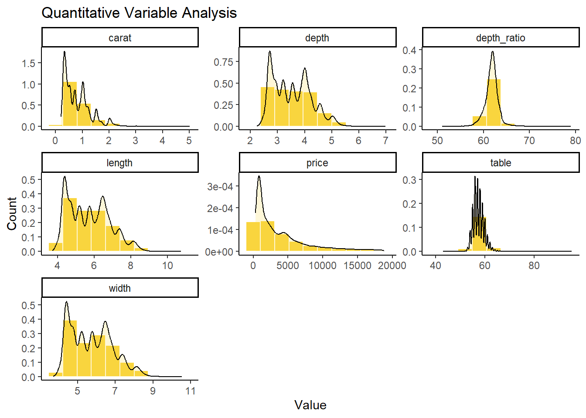
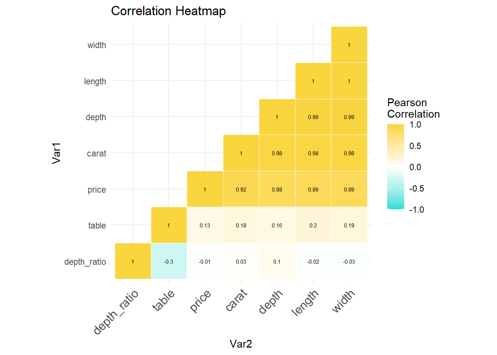

```{=html}
<style>
body{
  color: #2F91AE;
  background-color: #F2F2F2;
}
pre{
  background-color: #96EAE3;
}
pre:not([class]){
  background-color: #15DDD8;
}
.toc-content{
  padding-left: 10px;
  padding-right: 10px;
}
.col-sm-8 {
  width: 75%;
}
code {
  color: #333333;
  background-color: #96EAE3;
}
</style>
```


```r
library(data.table)     #for reading data.tables
library(kableExtra)     #for more elaborate tables
library(ggplot2)        #for making graphs
library(GGally)         #for making graphs
library(dplyr)          #for data manipulation
library(tidyr)          #for changing the shape and hierarchy of a data set
library(DataExplorer)   #for graphing missing value percentages
library(car)            #for statistic functions
library(ellipse)        #for mapping correlation
library(naniar)         #for missing values 

source("VIF.R")
```

# Data Exploration 


```r
diamonds <- fread("diamonds.csv", sep=",", header = T) # Load your data, diamonds.csv

diamonds$V1 <- NULL # Remove column 'V1' as it is similar to an ID variable - no additional meaning derived

# Rename columns for more precise names
colnames(diamonds)[5] <- "depth_ratio" # depth to depth_ratio
colnames(diamonds)[8] <- "length" # x to length
colnames(diamonds)[9] <- "width"  # y to width
colnames(diamonds)[10] <- "depth" # z to depth
```

## Dimension Summary 


```r
dim(diamonds) # Dimensions of data
```

```
## [1] 53940    10
```

```r
summary(diamonds) # Produce result summaries of all variables
```

```
##      carat            cut               color             clarity         
##  Min.   :0.2000   Length:53940       Length:53940       Length:53940      
##  1st Qu.:0.4000   Class :character   Class :character   Class :character  
##  Median :0.7000   Mode  :character   Mode  :character   Mode  :character  
##  Mean   :0.7979                                                           
##  3rd Qu.:1.0400                                                           
##  Max.   :5.0100                                                           
##   depth_ratio        table           price           length      
##  Min.   :43.00   Min.   :43.00   Min.   :  326   Min.   : 0.000  
##  1st Qu.:61.00   1st Qu.:56.00   1st Qu.:  950   1st Qu.: 4.710  
##  Median :61.80   Median :57.00   Median : 2401   Median : 5.700  
##  Mean   :61.75   Mean   :57.46   Mean   : 3933   Mean   : 5.731  
##  3rd Qu.:62.50   3rd Qu.:59.00   3rd Qu.: 5324   3rd Qu.: 6.540  
##  Max.   :79.00   Max.   :95.00   Max.   :18823   Max.   :10.740  
##      width            depth       
##  Min.   : 0.000   Min.   : 0.000  
##  1st Qu.: 4.720   1st Qu.: 2.910  
##  Median : 5.710   Median : 3.530  
##  Mean   : 5.735   Mean   : 3.539  
##  3rd Qu.: 6.540   3rd Qu.: 4.040  
##  Max.   :58.900   Max.   :31.800
```

```r
str(diamonds) # Type of variables
```

```
## Classes 'data.table' and 'data.frame':	53940 obs. of  10 variables:
##  $ carat      : num  0.23 0.21 0.23 0.29 0.31 0.24 0.24 0.26 0.22 0.23 ...
##  $ cut        : chr  "Ideal" "Premium" "Good" "Premium" ...
##  $ color      : chr  "E" "E" "E" "I" ...
##  $ clarity    : chr  "SI2" "SI1" "VS1" "VS2" ...
##  $ depth_ratio: num  61.5 59.8 56.9 62.4 63.3 62.8 62.3 61.9 65.1 59.4 ...
##  $ table      : num  55 61 65 58 58 57 57 55 61 61 ...
##  $ price      : int  326 326 327 334 335 336 336 337 337 338 ...
##  $ length     : num  3.95 3.89 4.05 4.2 4.34 3.94 3.95 4.07 3.87 4 ...
##  $ width      : num  3.98 3.84 4.07 4.23 4.35 3.96 3.98 4.11 3.78 4.05 ...
##  $ depth      : num  2.43 2.31 2.31 2.63 2.75 2.48 2.47 2.53 2.49 2.39 ...
##  - attr(*, ".internal.selfref")=<externalptr>
```

```r
# Number of unique values in each variable
sapply(diamonds, function(x) length(unique(x)))
```

```
##       carat         cut       color     clarity depth_ratio       table 
##         273           5           7           8         184         127 
##       price      length       width       depth 
##       11602         554         552         375
```

## Missing Values


```r
# Visualize missing values
gg_miss_var(diamonds) + ggtitle("Missing values")
```


```r
# pairs(diamonds[, c(1, 5:10)])
```


```r
# carat no problems
unique(diamonds$cut) # Review unique values for cut
```

```
## [1] "Ideal"     "Premium"   "Good"      "Very Good" "Fair"
```

```r
diamonds$cut <- as.factor(diamonds$cut) # Factor the cut to five levels 
diamonds$cut <- ordered(diamonds$cut, levels = c("Fair", "Good", "Very Good", "Premium", "Ideal")) # Ordered from worst to best

unique(diamonds$color) # Review unique values for color
```

```
## [1] "E" "I" "J" "H" "F" "G" "D"
```

```r
diamonds$color <- as.factor(diamonds$color) # Factor the color to seven levels 
diamonds$color <- ordered(diamonds$color, levels = c("J", "I", "H", "G", "F", "E", "D")) # Ordered from worst to best

unique(diamonds$clarity) # Review unique values for clarity
```

```
## [1] "SI2"  "SI1"  "VS1"  "VS2"  "VVS2" "VVS1" "I1"   "IF"
```

```r
diamonds$clarity <- as.factor(diamonds$clarity) # Factor the clarity to eight levels 
diamonds$clarity <- ordered(diamonds$clarity, levels = c("I1", "SI2", "SI1", "VS2", "VS1", "VVS2", "VVS1", "IF")) # Ordered from worst to best

# table is ok

# price is ok

# Remove values of 0 for for dimensions which includes zeros in length and width
nrow(diamonds[depth %in% 0,]) # Remove 20 rows due to depth = 0.0
```

```
## [1] 20
```

```r
diamonds <- diamonds[depth > 0, ] # Include only values with depth greater than zero

# Create formula to check the absolute value of length to width, comparison 
diamonds[, subtraction := abs(length - width)]
nrow(diamonds[subtraction>10,]) # Remove 2 rows due their extreme subtraction value (~59 and ~26)
```

```
## [1] 2
```

```r
diamonds <- diamonds[subtraction <= 10, ] # Include only values with subtraction less than ten

diamonds[, depth_check := round(100*(2*depth)/((length + width)), 1)]
diamonds[, diff := abs(depth_check-depth_ratio)]
# treshold at 0.3? anastasia
nrow(diamonds[diff > 0.3,]) # we remove 268 rows
```

```
## [1] 253
```

```r
diamonds <- diamonds[diff <= 0.3,]
# hist(diamonds[diff >= 0.4 & diff < 1, diff], breaks = 50)

# Removed created columns needed to clean the data
diamonds[, subtraction := NULL]
diamonds[, depth_check := NULL]
diamonds[, diff := NULL]
# Total rows remove: 275 observations
```


```r
# Reorder data table to group like variable types 
diamonds <- diamonds[, c(7, 2:4, 1, 8:10, 5:6)]
```


```r
# Used ggpairs to create a scatterplot matrix
# ggpairs(diamonds[, c(1, 5:10)], title = "Scatterplot Matrix",
#          proportions = "auto",
#          columnLabels = c("Price", "Carat", "Length", "Width", "Depth","Depth Ratio","Table"),
#          upper = list(continuous = wrap('cor',size = 3)),) + theme_light()
```

## Variable Visualisation


```r
ggplot(gather(data = diamonds[, c(1, 5:10)]), aes(value)) +
  geom_histogram(aes(y = after_stat(density)),
                 bins = 10,
                 color = "white",
                 fill = "#F9D53E") + # Creates bin sizing and sets the lines as white
  geom_density(alpha = .2, fill = "#F9D53E") +
  facet_wrap(~ key, scales = "free") + # Converting the graphs into panels
  ggtitle("Quantitative Variable Analysis") + # Title name
  ylab("Count") + xlab("Value") + # Label names
  theme_classic() # A classic theme, with x and y axis lines and no grid lines
```




```r
# Create heatmap to show variable correlation
# Round the correlation coefficient to two decimal places
cormat <- round(cor(diamonds[, c(1, 5:10)]), 2)

# Use correlation between variables as distance
reorder_cormat <- function(cormat){ 
dd <- as.dist((1-cormat)/2)
hc <- hclust(dd)
cormat <-cormat[hc$order, hc$order]
return(cormat)
}

# Reorder the correlation matrix
cormat <- reorder_cormat(cormat)

# Keeping only upper triangular matrix
# upper_tri returns TRUE/FALSE for each coordinate (TRUE -> part of upper triangle)
# multiplying will thus keep the upper triangle values and set the others to 0
cormat <- cormat*upper.tri(cormat, diag = TRUE)
# Values of the lower triangle (0) are replaced by NA
cormat[cormat == 0] <- NA

# Melt the correlation matrix
cormat <- reshape2::melt(cormat, na.rm = TRUE)

# Create a ggheatmap with multiple characteristics 
ggplot(cormat, aes(Var2, Var1, fill = value)) +
  geom_tile(color = "white") +
  scale_fill_gradient2(low = "#15DDD8", high = "#F9D53E", mid = "white",
                       midpoint = 0, limit = c(-1,1), space = "Lab", name="Pearson\nCorrelation") +
  ggtitle("Correlation Heatmap") + # Title name
  theme_minimal() + # Minimal theme, keeps in the lines
  theme(axis.text.x = element_text(angle = 45, vjust = 1, size = 12, hjust = 1)) +
  coord_fixed() +
  geom_text(aes(Var2, Var1, label = value), color = "black", size = 2)
```



```r
rm(cormat, reorder_cormat)
```


```r
plotcorr(cor(diamonds[, -c(2:4)]), col = "#F9D53E",
         main = "Pearson correlation ellipses for numerical variables")
```


```r
# set seed for reproducing the partition
set.seed(111)

# generating training set index
train.index <- sample(c(1:nrow(diamonds)), 0.5*nrow(diamonds))
# generating validation set index taken from the complementary of training set
valid.index <- sample(setdiff(c(1:nrow(diamonds)), train.index), 0.3*nrow(diamonds))
# defining test set index as complementary of (train.index + valid.index)
test.index <- as.numeric(setdiff(row.names(diamonds), union(train.index, valid.index)))
# creating data tables Train, Valid and Test using the indexes
Train <- diamonds[train.index, ]
Valid <- diamonds[valid.index, ]
Test <- diamonds[test.index, ]
```

# Dimension Reduction Analysis


```r
#diamonds_lm <- lm(price ~ carat + length + width + depth + depth_ratio + table, data = diamonds)
#diamonds_lm2 <- lm(price ~ carat + depth_ratio + table, data = diamonds)
#diamonds_lm3 <- lm(price ~ carat + depth + depth_ratio + table, data = diamonds)

#diamonds_vif <- vif(diamonds_lm)
#VIF(diamonds[, c(5:8)])
#diamonds_vif2 <- vif(diamonds_lm2)

#diamonds_vif3 <- vif(diamonds_lm3)


#summary(diamonds_vif)
```


# Variable Prediction and Model Performance Evaluation

## Linear Regression


## $k$-NN


## Regression Tree


```r
# Set 
diamonds_tree <- diamonds

Train <- diamonds_tree[train.index, ]
Valid <- diamonds_tree[valid.index, ]
Test <- diamonds_tree[test.index, ]
```


```r
price_correlation <- with(diamonds,
     data.frame(cor_length_price = cor(length, price),
                cor_width_price = cor(width, price),
                cor_depth_price = cor(depth, price),
                cor_depth_ratio_price = cor(depth_ratio, price),
                cor_table_price2 = cor(table, price),
                cor_carat_price3 = cor(carat, price)
     )
)

kable(price_correlation) %>% kable_classic() 
```

<table class=" lightable-classic" style='font-family: "Arial Narrow", "Source Sans Pro", sans-serif; margin-left: auto; margin-right: auto;'>
 <thead>
  <tr>
   <th style="text-align:right;"> cor_length_price </th>
   <th style="text-align:right;"> cor_width_price </th>
   <th style="text-align:right;"> cor_depth_price </th>
   <th style="text-align:right;"> cor_depth_ratio_price </th>
   <th style="text-align:right;"> cor_table_price2 </th>
   <th style="text-align:right;"> cor_carat_price3 </th>
  </tr>
 </thead>
<tbody>
  <tr>
   <td style="text-align:right;"> 0.8875709 </td>
   <td style="text-align:right;"> 0.8891923 </td>
   <td style="text-align:right;"> 0.8829303 </td>
   <td style="text-align:right;"> -0.010429 </td>
   <td style="text-align:right;"> 0.1272781 </td>
   <td style="text-align:right;"> 0.9218387 </td>
  </tr>
</tbody>
</table>


## NeuralNetworks


## Ensembles


# Model Performance Summary

# Conclusions

