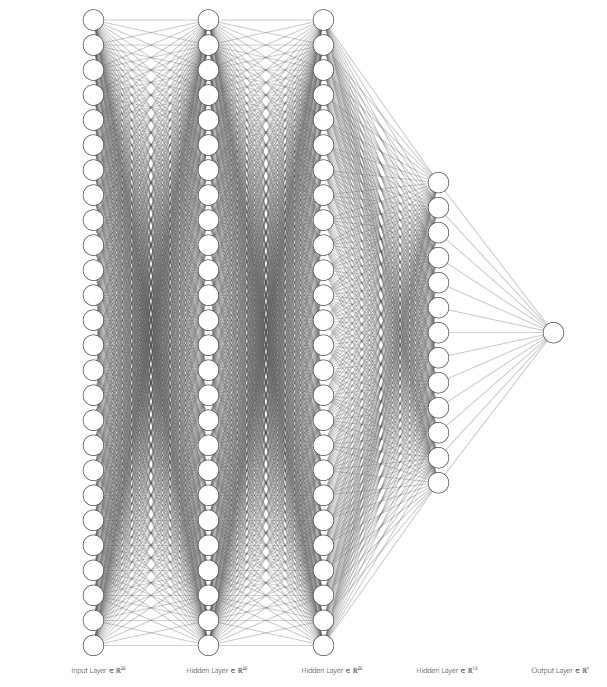

```{=html}
<style>
body{
  color: #2F91AE;
  background-color: #F2F2F2;
}
pre{
  background-color: #96EAE3;
}
pre:not([class]){
  background-color: #15DDD8;
}
.toc-content{
  padding-left: 10px;
  padding-right: 10px;
}
.col-sm-8 {
  width: 75%;
}
code {
  color: #333333;
  background-color: #96EAE3;
}
</style>
```

```{r setup, include=FALSE}
knitr::opts_chunk$set(message = FALSE, warning = FALSE, fig.align = "center", include = FALSE, dev = "png", cache = TRUE)
```

```{r Colors}
#Aqua =         "#15DDD8"
#Dark Blue =    "#2F91AE"
#Yellow =       "#F9D53E"
#Light Gray =   "#F2F2F2"
#Light Aqua =   "#96EAE3"
#Gold = "#D8B365" 
```

```{r Libraries}
################ General Use ######################
library(car)            #for statistic functions
library(DataExplorer)   #for graphing missing value percentages
library(data.table)     #for reading data.tables
library(dplyr)          #for data manipulation
library(fastDummies)    #for creating dummies
library(e1071)          #for skewness
library(ellipse)        #for mapping correlation
library(GGally)         #for making graphs
library(ggplot2)        #for making graphs
library(ggpubr)         #for plot alignment
library(gridExtra)
library(kableExtra)     #for more elaborate tables
library(knitr)
library(tidyr)          #for changing the shape and hierarchy of a data set
library(naniar)         #for missing values
library(RColorBrewer)   #for graph colors
library(rattle)         #Graphical Data Interface


################ For Predictions ######################
library(caret)          #for preProcess()
library(forecast)       #for accuracy() measures
library(FNN)            #for finding k nearest neighbor
library(gbm)            #for boosting
library(ipred)          #for bagging
library(vip)            #for variable importance
library(randomForest)   #for randomForest
library(rpart)          #for regression trees
library(rpart.plot)     #for plot trees
library(keras)          #front-end library for neural networks
library(magrittr)
library(tensorflow)     #backend python library for neural network


################ Personalized Functions ######################
source("VIF.R")         #for calculating VIF
source("GlobalCrit.R")  #for variable selection (exhaustive search)

################ Additonal Actions ######################
options(scipen = 999)                 #for removing scientific notation
tf$constant("Hello Tensorflow!")      #for initializing tensorflow environment
```

# Introduction

The following report provides the result of using machine learning as a tool to estimate diamond prices for a jewelry company. Using snapshot information from their asset database, various methods were applied to train predictive models using regression analysis. The main objective was to use supervised learning methods to predict prices. These models are later compared to measure their effectiveness by using error measurements to quantify the distance between the prediction and the actual price. Finally, conclusions on the capability of each model are made and suggestions are given on which model to apply for the problem at hand. 

The product being analyzed is diamonds. Being a luxury object with a long history, industry standards have been developed to serve as guidelines for estimating the value of the product. A wide variety of characteristics affect the overall price of diamonds, but this analysis will focus on their physical qualities, such as size dimensions, size ratios and color. Other factors inherent to scarce products in high demand of a capitalist economy will not be considered in our machine learning exercise.

The choice of methods shown in the report is not all inclusive and responds to the fact of only being some of the most used methods to this day. By implementing them, the analysts hope to provide a glimpse of the effects and importance in choosing the right model as well as displaying the differences between each one. 


# Data Exploration

In the early stages of any analysis, data exploration is a critical process aimed at understanding and analyzing the data set to gain insight and make valid decisions. The overarching goal of examining the data is to obtain intuition, identify questionable values, and strategize how to answer the problem statement. Therefore, let's summarize the findings that explain the main data characteristics, and dive into the relations between variables to understand how this analysis will be directed.

```{r Import Data}
diamonds <- fread("diamonds.csv", sep=",", header = T) # Load your data, diamonds.csv

diamonds$V1 <- NULL # Remove column 'V1' as it is similar to an ID variable - no additional meaning derived

# Rename columns for more precise names
colnames(diamonds)[5] <- "depth_ratio" # depth to depth_ratio
colnames(diamonds)[8] <- "length" # x to length
colnames(diamonds)[9] <- "width"  # y to width
colnames(diamonds)[10] <- "depth" # z to depth
```

## Dimension Summary 

There is a variety of ways an analyst could approach understanding the observations in the data set. For starters, there are 53,940 records and 10 variables. The response variable (price) is a an integer variable. There are an additional six numeric values and three ordinal/categorical features that have a factored structure. Those non-numeric values (`cut`, `color`, and `clarity`) need to be appropriately ordered, and renamed if there are any spaces within their naming convention as later this could obstruct certain code. 

To dive deeper, we consider removing observations that are invalid because they add noise. For instance, price against all features were reviewed for possible impurities. In total, there are 275 (0.5%) records removed for the following reasons:

1. 20 rows had a depth of 0.0. This was considered inaccurate because a diamond needs to have this dimension specified.  

2. The difference between length and width should be almost identical. If they were not, those rows were removed. In this case, only two records were not included in the data set at differences above 36.0mm.  

3. The depth_ratio is a calculation between length, width, and length. To investigate this feature further, our group computed depth_ratio and saw there were differences between the actual and predicted values. Therefore, the executive decision was to remove any differences above a threshold of 0.3. A total of 253 rows were removed.  

Fortunately, there were no null values that needed to be considered.

```{r Data Exploration}
dim(diamonds) # Dimensions of data
summary(diamonds) # Produce result summaries of all variables
str(diamonds) # Type of variables

# Number of unique values in each variable
sapply(diamonds, function(x) length(unique(x)))
```


```{r Missing Values}
# Missing values analysis
gg_miss_var(diamonds) + ggtitle("Missing values")
```


```{r Variables check}
############### carat no problems #################

############### cut ###############################
unique(diamonds$cut) # Review unique values for cut
# Factor the cut to five level
diamonds$cut <- as.factor(diamonds$cut) 

# Ordered from worst to best
diamonds$cut <- ordered(diamonds$cut, levels = c("Fair", "Good", "Very Good", "Premium", "Ideal")) 

############### color ############################
# Review unique values for color
unique(diamonds$color) 

# Factor the color to seven levels 
diamonds$color <- as.factor(diamonds$color) 

# Ordered from worst to best
diamonds$color <- ordered(diamonds$color, levels = c("J", "I", "H", "G", "F", "E", "D")) 

############### clarity ##########################
# Review unique values for clarity
unique(diamonds$clarity)

# Factor the clarity to eight levels 
diamonds$clarity <- as.factor(diamonds$clarity)

# Ordered from worst to best
diamonds$clarity <- ordered(diamonds$clarity, levels = c("I1", "SI2", "SI1", "VS2", "VS1", "VVS2", "VVS1", "IF")) 

############### table no problems#################

############### price no problems#################

############### Other Checks #####################

# Remove values of 0 for for dimensions which includes zeros in length and width
nrow(diamonds[depth %in% 0,]) # Remove 20 rows due to depth = 0.0
diamonds <- diamonds[depth > 0, ] # Include only values with depth greater than zero

# Create formula to check the absolute value of length to width, comparison 
diamonds[, subtraction := abs(length - width)]
nrow(diamonds[subtraction>10,]) # Remove 2 rows due their extreme subtraction value (~59 and ~26)
diamonds <- diamonds[subtraction <= 10, ] # Include only values with subtraction less than ten

# Check if the Depth_Ratio value corresponds to formula indicated in the description
diamonds[, depth_check := round(100*(2*depth)/((length + width)), 1)]
diamonds[, diff := abs(depth_check-depth_ratio)]
```

```{r threshold diff hist, fig.height = 2, fig.width = 3, include = TRUE, echo = FALSE}
# Create histogram to look at the differences between how much price is off between a calculated value and what the data provided
hist(diamonds[diff >= 0.2 & diff < 1, diff], breaks =50, col = "#D8B365", border = "#D8B365", main = "Threshold Differences", xlab = "Predicted vs. Actual Difference", cex.lab=0.8, cex.axis=0.8, cex.main=0.8, cex.sub=0.8)
```

```{r Variables check cont.}
# Threshold set to 0.3 due to ... (report)
nrow(diamonds[diff > 0.3,]) # We remove 268 rows
diamonds <- diamonds[diff <= 0.3,]
```

```{r remove columns}
# Removed created columns needed to clean the data
diamonds[, subtraction := NULL]
diamonds[, depth_check := NULL]
diamonds[, diff := NULL]
# Total rows remove: 275 observations
```


```{r ordering columns}
# Reorder data table to group like variable types 
diamonds <- diamonds[, c(7, 2:4, 1, 8:10, 5:6)]
```

The second part of exploring the diamonds data set is to understand the relationships between variables. Prior to analyzing their correlations, we had an idea of which continuous variables would have a strong relation due to the depth_ratio calculation. Later on, certain methods will analyze the potential issue of collinearity. By isolating price against the other continuous variables, carat, length, width, and depth, all have positively linear relations to the response feature. Some of the models used in the analysis to predict price will show these effects. In addition, the relationship between carat and price is unique  because their relation is non-linear. We were also interested in showing how the categorical variables affect price. Clarity, color, and cut have distinct patterns seen between the four continuous variables mentioned above. 

```{r ggpairs, eval=FALSE, fig.height=6, fig.width=6, include=FALSE}
#Used ggpairs to create a scatterplot matrix between quantitative variables 
ggpairs(diamonds[, c(1, 5:10)], title = "Scatterplot Matrix",
         proportions = "auto",
         columnLabels = c("Price", "Carat", "Length", "Width", "Depth","Depth Ratio","Table"),
         upper = list(continuous = wrap('cor',size = 3)),) + theme_light()
```

For instance, when plotting price by carat, width, length, and depth, with clarity as the color dimension, there is a clear distinction between how these points relate. Each scatter plot shows a strong, positive correlation to price. When reviewing the x-axis for each explanatory variable, the lower tiered option is typically observed more. The cheaper the gemstone, the worse quality the customer bought. Within each plot, there are outliers that can be explained by how the diamond was cut, which impacts the weight, length, and depth. By the color scale, it is noticed how there are more diamonds with a worse clarity (SI2/SI1) than there are with the best (IF/VVS1). Intuitively, this makes sense because not all customers have the available funds to afford the optimally designed diamond. On the other hand, no one wants the worst clarity either. Therefore, a majority of the diamonds lie between the second and third best, and second and third worst clarity factors. In addition, the relation between depth_ratio and table to price is not distinct as those features are mixed throughout the relative ranges. Within all of the depth_ratio plots, there are vertical lines that show the depth_ratio  mean (black) and range (red) of what is considered the prime value for depth_ratio as long as it is above 59% but does not exceed 62.3%. 

```{r Price by X and Clarity, fig.width = 6, fig.height = 6,include = TRUE, echo = FALSE, dpi = 150}
# Create plot that looks at carat and price
PCl1 <- ggplot(aes(x = carat, y = price), data = diamonds) + geom_point(alpha = 0.5, size = 1, position = 'jitter',aes(color=clarity)) +
  scale_color_brewer(type = 'div', guide = guide_legend(title = 'Clarity', reverse = T,override.aes = list(alpha = 1, size = 2))) + theme_classic()

# Create plot that looks at length and price
PCl2 <- ggplot(aes(x = length, y = price), data = diamonds) + geom_point(alpha = 0.5, size = 1, position = 'jitter',aes(color=clarity)) +
  scale_color_brewer(type = 'div', guide = guide_legend(title = 'Clarity', reverse = T,override.aes = list(alpha = 1, size = 2))) + theme_classic()

# Create plot that looks at width and price
PCl3 <- ggplot(aes(x = width, y = price), data = diamonds) + geom_point(alpha = 0.5, size = 1, position = 'jitter',aes(color=clarity)) +
  scale_color_brewer(type = 'div', guide = guide_legend(title = 'Clarity', reverse = T,override.aes = list(alpha = 1, size = 2))) + theme_classic()

# Create plot that looks at depth and price
PCl4 <- ggplot(aes(x = depth, y = price), data = diamonds) + geom_point(alpha = 0.5, size = 1, position = 'jitter',aes(color=clarity)) +
  scale_color_brewer(type = 'div', guide = guide_legend(title = 'Clarity', reverse = T,override.aes = list(alpha = 1, size = 2)))  + theme_classic()

# Create plot that looks at depth_ratio and price
PCl5 <- ggplot(aes(x = depth_ratio, y = price), data = diamonds) + geom_point(alpha = 0.5, size = 1, position = 'jitter',aes(color=clarity))  + scale_color_brewer(type = 'div', guide = guide_legend(title = 'Clarity', reverse = T,override.aes = list(alpha = 1, size = 2)))  + theme_classic() + geom_vline(xintercept=mean(diamonds$depth_ratio), size = 1, color = "black") + geom_vline(xintercept=59, size = 1, color = "red") + geom_vline(xintercept=62.3, size = 1, color = "red")

# Create plot that looks at table and price
PCl6 <- ggplot(aes(x = table, y = price), data = diamonds) +  geom_point(alpha = 0.5, size = 1, position = 'jitter',aes(color=clarity))  + scale_color_brewer(type = 'div', guide = guide_legend(title = 'Clarity', reverse = T,override.aes = list(alpha = 1, size = 2))) + theme_classic() + geom_vline(xintercept=mean(diamonds$table), size = 1, color = "black") 
# Arrange ggplots into one frame
ggarrange(PCl1, PCl2, PCl3,PCl4, PCl5, PCl6,
                    ncol = 2, nrow = 3, common.legend = TRUE, legend="right")
```

A similar relationship can be seen regarding price by the continuous variables, but as color as the color dimension. Instead of most of the observations falling closer to the best and worth clarify features, here the reader will notice how it appears that the colors E, F and G dominate (the white to light blue) the retail space. 

```{r Price by X and Color, fig.width = 6, fig.height = 6, include = TRUE, echo = FALSE, dpi = 150}
# Create plot that looks at carat and price
PCo1 <- ggplot(aes(x = carat, y = price), data = diamonds) + geom_point(alpha = 0.5, size = 1, position = 'jitter',aes(color=color)) +
  scale_color_brewer(type = 'div', guide = guide_legend(title = 'Color', reverse = T,override.aes = list(alpha = 1, size = 2))) + theme_classic()

# Create plot that looks at length and price
PCo2 <- ggplot(aes(x = length, y = price), data = diamonds) + geom_point(alpha = 0.5, size = 1, position = 'jitter',aes(color=color)) +
  scale_color_brewer(type = 'div', guide = guide_legend(title = 'Color', reverse = T,override.aes = list(alpha = 1, size = 2))) + theme_classic()

# Create plot that looks at width and price
PCo3 <- ggplot(aes(x = width, y = price), data = diamonds) + geom_point(alpha = 0.5, size = 1, position = 'jitter',aes(color=color)) +
  scale_color_brewer(type = 'div', guide = guide_legend(title = 'Color', reverse = T,override.aes = list(alpha = 1, size = 2))) + theme_classic()

# Create plot that looks at depth and price
PCo4 <- ggplot(aes(x = depth, y = price), data = diamonds) + geom_point(alpha = 0.5, size = 1, position = 'jitter',aes(color=color)) +
  scale_color_brewer(type = 'div', guide = guide_legend(title = 'Color', reverse = T,override.aes = list(alpha = 1, size = 2)))   + theme_classic()

# Create plot that looks at depth_ratio and price
PCo5 <- ggplot(aes(x = depth_ratio, y = price), data = diamonds) + geom_point(alpha = 0.5, size = 1, position = 'jitter',aes(color=color))  + scale_color_brewer(type = 'div', guide = guide_legend(title = 'Color', reverse = T,override.aes = list(alpha = 1, size = 2))) + theme_classic() + geom_vline(xintercept=mean(diamonds$depth_ratio), size = 1, color = "black")  + geom_vline(xintercept=59, size = 1, color = "red") + geom_vline(xintercept=62.3, size = 1, color = "red")

# Create plot that looks at table and price
PCo6 <- ggplot(aes(x = table, y = price), data = diamonds) +  geom_point(alpha = 0.5, size = 1, position = 'jitter',aes(color=color))  + scale_color_brewer(type = 'div', guide = guide_legend(title = 'Color', reverse = T,override.aes = list(alpha = 1, size = 2))) + theme_classic() + geom_vline(xintercept=mean(diamonds$table), size = 1, color = "black")

# Arrange ggplots into one frame
ggarrange(PCo1, PCo2, PCo3,PCo4, PCo5, PCo6,
                    ncol = 2, nrow = 3, common.legend = TRUE, legend="right")
```

Cut has a completely different trend than clarity and color as a majority of customers prefer and will purchase the ideal cut. This can be seen within the depth_ratio plot especially. As stated earlier, the red lines indicate the optimal space in which a buyer would want the diamond's depth_ratio. Most of all of the ideal cuts are within those bounds while the fair, good, and very good are outside. There is a clear distinction on how cut relates to the depth_ratio along price.

```{r Price by X and Cut, fig.width = 6, fig.height = 6, include = TRUE, echo = FALSE, dpi = 150}
# Create plot that looks at carat and price
PCu1 <- ggplot(aes(x = carat, y = price), data = diamonds) + geom_point(alpha = 0.5, size = 1, position = 'jitter',aes(color=cut)) +
  scale_color_brewer(type = 'div', guide = guide_legend(title = 'Cut', reverse = T,override.aes = list(alpha = 1, size = 2))) + theme_classic()

# Create plot that looks at length and price
PCu2 <- ggplot(aes(x = length, y = price), data = diamonds) + geom_point(alpha = 0.5, size = 1, position = 'jitter',aes(color=cut)) +
  scale_color_brewer(type = 'div', guide = guide_legend(title = 'Cut', reverse = T,override.aes = list(alpha = 1, size = 2))) + theme_classic()

# Create plot that looks at width and price
PCu3 <- ggplot(aes(x = width, y = price), data = diamonds) + geom_point(alpha = 0.5, size = 1, position = 'jitter',aes(color=cut)) +
  scale_color_brewer(type = 'div', guide = guide_legend(title = 'Cut', reverse = T,override.aes = list(alpha = 1, size = 2))) + theme_classic()

# Create plot that looks at depth and price
PCu4 <- ggplot(aes(x = depth, y = price), data = diamonds) + geom_point(alpha = 0.5, size = 1, position = 'jitter',aes(color=cut)) +
  scale_color_brewer(type = 'div', guide = guide_legend(title = 'Cut', reverse = T,override.aes = list(alpha = 1, size = 2))) + theme_classic()

# Create plot that looks at depth_ratio and price
PCu5 <- ggplot(aes(x = depth_ratio, y = price), data = diamonds) + geom_point(alpha = 0.5, size = 1, position = 'jitter',aes(color=cut))  + scale_color_brewer(type = 'div', guide = guide_legend(title = 'Cut', reverse = T,override.aes = list(alpha = 1, size = 2))) + theme_classic() + geom_vline(xintercept=mean(diamonds$depth_ratio), size = 1, color = "black") + geom_vline(xintercept=59, size = 1, color = "red") + geom_vline(xintercept=62.3, size = 1, color = "red")

# Create plot that looks at table and price
PCu6 <- ggplot(aes(x = table, y = price), data = diamonds) +  geom_point(alpha = 0.5, size = 1, position = 'jitter',aes(color=cut))  + scale_color_brewer(type = 'div', guide = guide_legend(title = 'Cut', reverse = T,override.aes = list(alpha = 1, size = 2))) + theme_classic() + geom_vline(xintercept=mean(diamonds$table), size = 1, color = "black")

# Arrange ggplots into one frame
ggarrange(PCu1, PCu2, PCu3,PCu4, PCu5, PCu6,
                    ncol = 2, nrow = 3, common.legend = TRUE, legend="right")
```


```{r Price Correlation}
# Correlation between price and quantitative variables
price_correlation <- with(diamonds,
     data.frame(cor_length_price = cor(length, price), cor_width_price = cor(width, price), cor_depth_price = cor(depth, price), cor_depth_ratio_price = cor(depth_ratio, price), cor_table_price2 = cor(table, price), cor_carat_price3 = cor(carat, price)))

# Transpose data and put into kable format
transpose <- t(sort(round(price_correlation,4),decreasing = FALSE))
kable_corr <- kable(transpose) %>% kable_classic() 
kable_corr
```

## Variable Visualisation
As a continuation of data exploration, variable visualization involves creating graphical representations of data to visually communicate insights and trends. It allows us to quickly and easily identify patterns that may not be immediately apparent from looking at raw data. There are three graphics that demonstrate how these continuous values are distributed. Since some models take into account transformation, those details will be described later. As a high-level overview, price and carat are positively skewed. In the scatter plot regarding price by cut for the depth_ratio, the histogram also displays the same conclusion that the cut features  fall into approximately 60 to 65 mm. The relationships in the Correlation heat map visually show how width, length, depth, and carat continue to be highly correlated with price while depth_ratio and table are closer to 0. Another way to visualize the relationships is through the Pearson Correlation Ellipses chart. The skinnier the ellipse, the more correlated the two values are. 

Through exploration, we can gain a deeper understanding of the data and how it can be used to answer business questions or solve real-world problems, like predicting the price of a diamond.

```{r categorical bar plots, fig.height=2.5, fig.width=4, include=TRUE, echo=FALSE}
ggplot(gather(data = diamonds[, c(2:4)]), aes(value)) +
  geom_bar(aes(value),
                 width = 0.3,
                 color = "black",
                 fill = "#D8B365") + # Creates bin sizing and sets the lines as white
  facet_wrap(~ key, scales = "free") + # Converting the graphs into panels
  ggtitle("Qualitative Variable Analysis") + # Title name
  ylab("Count") + xlab("Value") + # Label names
  theme_classic()+ theme(axis.text.x = element_text(angle = 90, vjust = 0.5, hjust=1))
```


```{r Histograms, include = TRUE, echo = FALSE, dpi = 150}
ggplot(gather(data = diamonds[, c(1, 5:10)]), aes(value)) +
  geom_histogram(aes(y = after_stat(density)),
                 bins = 10,
                 color = "white",
                 fill = "#D8B365") + # Creates bin sizing and sets the lines as white
  geom_density(alpha = .2, fill = "#D8B365") +
  facet_wrap(~ key, scales = "free") + # Converting the graphs into panels
  ggtitle("Quantitative Variable Analysis") + # Title name
  ylab("Count") + xlab("Value") + # Label names
  theme_classic() # A classic theme, with x and y axis lines and no grid lines
```


```{r Correlation, include = TRUE, echo = FALSE, dpi = 150, fig.height = 3, fig.width = 3}
# Create heatmap to show variable correlation
# Round the correlation coefficient to two decimal places
cormat <- round(cor(diamonds[, c(1, 5:10)]), 2)

# Use correlation between variables as distance
reorder_cormat <- function(cormat){ 
dd <- as.dist((1-cormat)/2)
hc <- hclust(dd)
cormat <-cormat[hc$order, hc$order]
return(cormat)
}

# Reorder the correlation matrix
cormat <- reorder_cormat(cormat)

# Keeping only upper triangular matrix
# upper_tri returns TRUE/FALSE for each coordinate (TRUE -> part of upper triangle)
# multiplying will thus keep the upper triangle values and set the others to 0
cormat <- cormat*upper.tri(cormat, diag = TRUE)
# Values of the lower triangle (0) are replaced by NA
cormat[cormat == 0] <- NA

# Melt the correlation matrix
cormat <- reshape2::melt(cormat, na.rm = TRUE)

# Create a ggheatmap with multiple characteristics 
ggplot(cormat, aes(Var2, Var1, fill = value)) +
  geom_tile(color = "white") +
  scale_fill_gradient2(low = "#D8B365", high = "#15DDD8", mid = "white",
                       midpoint = 0, limit = c(-1,1), space = "Lab", name="Pearson\nCorrelation") +
  ggtitle("Correlation Heatmap") + # Title name
  theme_minimal() + # Minimal theme, keeps in the lines
  theme(axis.text.x = element_text(angle = 45, vjust = 1, size = 8, hjust = 1), text = element_text(size = 10)) +
  coord_fixed() +
  labs(x="", y = "")+
  geom_text(aes(Var2, Var1, label = value), color = "black", size = 2)

rm(cormat, reorder_cormat)
```


```{r train-valid-test}
# set seed for reproducing the partition
set.seed(111)

# generating training set index
train.index <- sample(c(1:nrow(diamonds)), 0.5*nrow(diamonds))

# generating validation set index taken from the complementary of training set
valid.index <- sample(setdiff(c(1:nrow(diamonds)), train.index), 0.3*nrow(diamonds))

# defining test set index as complementary of (train.index + valid.index)
test.index <- as.numeric(setdiff(row.names(diamonds), union(train.index, valid.index)))

# creating data tables Train, Valid and Test using the indexes
Train <- diamonds[train.index, ]
Valid <- diamonds[valid.index, ]
Test <- diamonds[test.index, ]
```

# Variable Prediction and Model Performance Evaluation

## Linear Regression

### Data preparation

We begin by performing linear regressions on our data. As we saw during the exploration phase, some predictors (`carat`, `length`, `width` and `depth`) are highly correlated. Therefore, multicollinearity might be an issue.

We use the Generalized Variation Inflation Factors (GVIF) to measure the multicollinearity level of our data. This generalized version of the VIF allows us to take into account numerical and categorical predictors together. The GVIF clearly confirms that there is an issue, as `length`, `width` and `depth` all have coefficients above 1000. `carat` and `depth_ratio` also have high values above 25, but they aren't as high extreme as the other three.

After removing `length`, `width` and `depth`, the GVIF coefficients of the remaining predictors are all under 2, which indicates the multicollinearity problem is solved. We display correlation ellipses of numerical variables without `length`, `width` and `depth`.

```{r LR data partition}
# creating training and validation sets
Train_lr <- diamonds[train.index, ]
Valid_lr <- diamonds[valid.index, ]
```

```{r vif}
# using the VIF function from statistical modelling to check multicollinearity of predictors
VIF(y = diamonds$price, matx = diamonds[, -c(1)])
# removing length, width and depth and computing VIF without them
VIF(y = diamonds$price, matx = diamonds[, -c(1, 6, 7, 8)])
```


```{r uncorrelated-ellipses, include=TRUE, echo=FALSE, dpi = 150, fig.height=3, fig.width=3}
# plotting correlation ellipses of numerical variables with length, width and depth removed
plotcorr(cor(diamonds[, -c(2:4)]), col = "#D8B365",
         main = "Pearson correlation ellipses for numerical variables", cex.lab=0.8, cex.axis=0.8, cex.main=0.7, cex.sub=0.8)
```

The only high correlation left is between `carat` and `price`, indicating that `carat` will surely be an important predictor for determining `price`.

Thus, we will perform linear regressions on two different models:

1.  `LM_complete` which contains all predictors
2.  `LM_minus_corr` which has `length`, `width` and `depth` removed.

These two models will serve as basis for variable selection procedures later.

However, before starting to build our models, we also need to account for skewed variables. Linear regression might perform worse when dealing with skewed variables and it is common to use transformations such as a logarithm or a $n$th root to make variable more symmetrical.

We use an estimator of skewness called \$b_1\$, whose definition can be found [here](https://en.wikipedia.org/wiki/Skewness#Sample_skewness).

The value of $b_1$ is interpreted as follows:

-   $0 \leq |b_1| < 0.5$: variable is symmetrical;
-   $0.5 \leq |b_1| < 1$: variable is moderately skewed;
-   $|b_1| \geq 1$: variable is highly skewed.

We compute $b_1$ on our numerical variables and get the following results.

```{r skewness-table, include=TRUE, echo=FALSE}
# applying the skewness() function of every numerical variable from our training set
kable_classic(kable(sapply(Train_lr[, c(1, 5:10)], skewness), col.names = "$b_1$",
      caption = "Skewness estimator for numerical variables"))
```


```{r skewness}
# logarithmic transformation on price, carat and table
Train_lr$price <- log(Train_lr$price)
Train_lr$carat <- log(Train_lr$carat)
Train_lr$table <- log(Train_lr$table)

# recomputing the skewness of numerical variables to see the improvement
sapply(Train_lr[, c(1, 5:10)], skewness)

# transforming in the validation set as well
Valid_lr$price <- log(Valid_lr$price)
Valid_lr$carat <- log(Valid_lr$carat)
Valid_lr$table <- log(Valid_lr$table)
```

`price` and `carat` are highly skewed and `table` is moderately skewed.

We apply a logarithmic transformation to all three variables. The improvement can also be seen in the histograms, as they look more symmetrical now.

```{r hist-unskewed, include=TRUE, echo=FALSE, dpi = 150}
# computing the histograms of numerical variables now that they are unskewed

ggplot(gather(data = Train_lr[, c(1, 5:10)]), aes(value)) + # numerical vars of training set
  geom_histogram(aes(y = after_stat(density)),              # making histograms with color params
                 color = "white",
                 fill = "#D8B365") +             
  geom_density(alpha = .2, fill = "#D8B365") +              # making density lines
  facet_wrap(~ key, scales = "free") +                      # multiple plots with facet
  labs(title = "Histograms of numerical variables",         # labels of the plot
       x = "Count",
       y = "Value") +
  theme_classic()                                           # aesthetic theme
```


We also standardize numerical variables by subtracting their mean and dividing by their standard deviation. This makes the comparison of $\beta$ coefficients between variables easier.

```{r normalizing}
# we compute the the mean and std values based on training data (for numerical variables)
norm.values <- preProcess(Train_lr[, c(1, 5:10)], method=c("center", "scale"))

# we standardize the training and validation data
Train_lr[, c(1, 5:10)] <- predict(norm.values, Train_lr[, c(1, 5:10)])
Valid_lr[, c(1, 5:10)] <- predict(norm.values, Valid_lr[, c(1, 5:10)])
```

### Linear models based on complete set of predictors

The data is now ready for our linear models. For both `LM_complete` and `LM_minus_corr`, we perform the following linear regressions:

1. Linear regression on the whole model
2. Forward selection on the model (iterative method)
3. Backward selection on the model (iterative method)
4. Stepwise selection on the model (iterative method)
5. Mallows's $C_p$ and AIC selection on the model (global method)

```{r LM-complete}
# we compute the linear model using all predictors and display its summary
LM_complete = lm(price ~. , data = Train_lr)
summary(LM_complete)
```

```{r iterative-search-complete}
# we use iterative search algorithms on the complete model: forward, backward and stepwise
# we display summaries of the three models obtained with iterative methods

LM_forward_complete = step(LM_complete, direction = "forward")
summary(LM_forward_complete)

LM_backward_complete = step(LM_complete, direction = "backward")
summary(LM_backward_complete)

LM_stepwise_complete = step(LM_complete, direction = "both")
summary(LM_stepwise_complete)
```

```{r LM_CpAIC_complete}
# we use the GlobalCrit function from statistical modelling to reduce the number of predictors
# using global criterions: Mallows's Cp and AIC
GlobalCrit(LM_complete)

# we compute the linear model obtained with global methods and display its summary
LM_CpAIC_complete = lm(price ~ . , data = Train_lr[, c(1:6, 8, 9)])
summary(LM_CpAIC_complete)
```

### Linear models based on uncorrelated predictors

```{r LM-minus-corr}
# we define a training set without the correlated predictors (length, width, depth)
Train_minus_corr <- Train_lr[, -c(6:8)]

# we compute the linear model without correlated predictors and display its summary
LM_minus_corr = lm(price ~ ., data = Train_minus_corr)
summary(LM_minus_corr)
```

```{r iterative-search-minus-corr}
# we use iterative search algorithms on the model without corr: forward, backward and stepwise
# we display summaries of the three models obtained with iterative methods

LM_backward_minus_corr = step(LM_minus_corr, direction = "backward")
summary(LM_backward_minus_corr)

LM_forward_minus_corr = step(LM_minus_corr, direction = "forward")
summary(LM_forward_minus_corr)

LM_stepwise_minus_corr = step(LM_minus_corr, direction = "both")
summary(LM_stepwise_minus_corr)
```

```{r LM_CpAIC_minus_corr}
# we use the GlobalCrit function from statistical modelling to reduce the number of predictors
# using global criterions: Mallows's Cp and AIC
GlobalCrit(LM_minus_corr)

# we compute the linear model obtained with global methods and display its summary
LM_CpAIC_minus_corr = lm(price ~ . , data = Train_lr[, c(1:5, 9)])
summary(LM_CpAIC_minus_corr)
```

### Summary of models

For each of these models, we summarise which variables are used as predictors in the following table.

```{r Variable Selection Summary, include=TRUE, echo=FALSE}
# we display a table of the predictors used in each model using kable()
# kable_classic() changes the kable style

kable_classic(
  kable(
    # the data to display in the table: model names and crosses for presence of predictor
    data.table(Model = c("LM_complete", "LM_forward_complete", "LM_backward_complete",
                       "LM_stepwise_complete", "LM_CpAIC_complete",
                       "LM_minus_corr", "LM_forward_minus_corr", "LM_backward_minus_corr",
                       "LM_stepwise_minus_corr", "LM_CpAIC_minus_corr"),
             Cut           = c("X","X","X","X","X","X","X","X","X","X"),
             Color         = c("X","X","X","X","X","X","X","X","X","X"),
             Clarity       = c("X","X","X","X","X","X","X","X","X","X"),
             Carat         = c("X","X","X","X","X","X","X","X","X","X"),
             Length        = c("X","X","X","X","X"," "," "," "," "," "),
             Width         = c("X","X"," "," "," "," "," "," "," "," "),
             Depth         = c("X","X","X","X","X"," "," "," "," "," "),
             `Depth Ratio` = c("X","X","X","X","X","X","X","X","X","X"),
             Table         = c("X","X"," "," "," ","X","X"," "," "," ")
             ),
    align = 'lccccccccc',                               # alignment of each column
    caption = "Predictors used in each linear model"),  # caption of the table
    )

```


For both basis models, forward selection doesn't discard any variables, whereas backward, stepwise and global selections all choose the same model with less variables than initially.

Thus, we have four distinct models in total. We assess the predictive performance of these four models on our validation set by computing the five accuracy measures seen during the course.

Let us recall the definitions and meaning of these measures (Data Mining for Business Analytics - Concepts, Techniques, and Applications in R, chapter 5.2, page 119). We denote the residuals by $r = y - \hat y$.

1.  **ME** (Mean Error) gives an indication of whether the predictions are on average over- or under-predicting the outcome variable. $$ME = \dfrac{1}{n} \sum_{i=1}^{n}r_i$$
2.  **RMSE** (Root Mean Squared Error) is similar to the standard error of estimate in linear regression, except that it is computed on the validation data rather than on the training data. $$RMSE =  \sqrt{\dfrac{1}{n}\sum_{i=1}^{n}r_i^2}$$
3.  **MAE** (Mean Absolute Error) gives the magnitude of the average absolute error. $$MAE = \dfrac{1}{n} \sum_{i=1}^{n}|r_i|$$
4.  **MPE** (Mean Percentage Error) gives the percentage score of how predictions deviate from the actual values (on average), taking into account the direction of the error. $$MPE = 100 \cdot \dfrac{1}{n} \sum_{i=1}^{n} \dfrac{r_i}{y_i}$$
5.  **MAPE** (Mean Absolute Percentage Error) gives a percentage score of how predictions deviate (on average) from the actual values. $$MAPE = 100 \cdot \dfrac{1}{n} \sum_{i=1}^{n} \left| \dfrac{r_i}{y_i}\right|$$


```{r remove models}
# we remove redundant models
rm(LM_forward_complete, LM_backward_complete, LM_stepwise_complete, LM_forward_minus_corr, LM_backward_minus_corr, LM_stepwise_minus_corr)
```

### Accuracy measures of models on validation set

```{r predictions-table}
# predicting prices of validation set on the validation data

# we create a data table of predictions which contains predictions for the four models
# predictions are computed on validation set using predict()
LM_Predictions =
  data.table(
    LM_complete_pred = predict(object = LM_complete, newdata = Valid_lr),
    LM_CpAIC_complete_pred = predict(object = LM_CpAIC_complete, newdata = Valid_lr),
    LM_minus_corr_pred = predict(object = LM_minus_corr, newdata = Valid_lr),
    LM_CpAIC_minus_corr_pred = predict(object = LM_CpAIC_minus_corr, newdata = Valid_lr)
    )
```

```{r rescaling-predictions}
# we have to scale back the price, to do so we fetch the mean and std value from norm.values

# we display all means and stds
norm.values$mean
norm.values$std

# fetching for price
mean_price = norm.values$mean[1]
std_price = norm.values$std[1]

# scaling back (Y*mu + sigma), then exp() (we had transformed price with a log for skewness)
LM_Predictions = LM_Predictions*std_price + mean_price
LM_Predictions = exp(LM_Predictions)
```

```{r real-prices}
# taking real prices of validation data from diamonds (which has not been touched -> original scale)
LM_Predictions[, real_prices := diamonds[valid.index, price]]
```

The accuracy measures for our four models are summarized below. In order to give meaningful results, the outcome variable `price` has been rescaled to its original scale and retransformed by taking the exponential (to cancel out the logarithm). Thus, the ME, RMSE and MAE can be interpreted in the price currency, dollars.

```{r models-accuracy-measures}
# we compute accuracy measures for each model using accuracy() from the forecast package
# we convert each accuracy to a table (in order to put them together afterwards)

Acc1 = accuracy(object = LM_Predictions$LM_complete_pred, x = LM_Predictions$real_prices)
Acc1 = as.data.table(Acc1)
Acc2 = accuracy(object = LM_Predictions$LM_CpAIC_complete_pred, x = LM_Predictions$real_prices)
Acc2 = as.data.table(Acc2)
Acc3 = accuracy(object = LM_Predictions$LM_minus_corr_pred, x = LM_Predictions$real_prices)
Acc3 = as.data.table(Acc3)
Acc4 = accuracy(object = LM_Predictions$LM_CpAIC_minus_corr_pred, x = LM_Predictions$real_prices)
Acc4 = as.data.table(Acc4)

# we create a list of accuracy measures
Accs = list(Acc1, Acc2, Acc3, Acc4)
# we use rbindlist() from the data.table package to stack the four tables on top of eachother
Accs = rbindlist(Accs)
# now that Accs is created we can remove the four tables
rm(Acc1, Acc2, Acc3)
# we add a column to Accs with the model names
Accs[, Model := c("LM_complete", "LM_CpAIC_complete", "LM_minus_corr", "LM_CpAIC_minus_corr")]
# we put the Model column first
Accs <- Accs[, c(6, 1:5)]
```


```{r models-accuracy-table, include=TRUE, echo=FALSE}
# displaying Accs as a table with kable() and adding a caption
# kable_classic controls style of table
kable_classic(kable(Accs, caption = "Accuracy measures of linear models"))
```

The mean error is bigger in the models without multicollinearity issues, but their RMSE is smaller. Since the mean error is positive in all four models, we are under-predicting the price of diamonds by 36 or 50 dollars on average depending on the model.

An increase of 14$ in the mean error is a good trade-off to reducing the RMSE, which indicates how much the predictions will fluctuate from real values. The other three measures are quite close in all four models.

Considering the parsimony principle and the RMSE, the best choice is our fourth linear model, which contains `cut`, `color`, `clarity`, `carat` and `depth_ratio`.

Overall, the RMSE for linear regression remains quite high and as we will see in the following chapters, some models will achieve much better predictive performances.


## $k$-NN

#### Overview
$k$-nearest neighbors (kNN) is a simple algorithm used for classification (categorical) and regression (continuous). Since the response variable (price) is a numeric outcome, this analysis will use $k$-NN to predict the price of a diamond. In a regression setting, the algorithm relies on finding the most 'similar' records in the training data. Then, one would calculate the weighted average of the numerical target of the $k$-nearest neighbors for the data point.

According to the Data Mining textbook, the value of k is based on a nonparametric method since it 'draws information from similarities between the predictor values of the records in the dataset.' There are several ways one could choose this hyperparameter, but this analysis will focus on one method by the optimization of RMSE. k is a critical input within the $k$-NN function because it determines how many neighbors will be considered when making a prediction. Penn State states that a 'larger k leads to a smoother boundary but may also introduce noise.' On the other side, a small k 'can increase the complexity of KNN.'

The $k$-nearest neighbors algorithm is very useful when predicting price because the data does not need to be transformed or predictors selected in a particular way. 

#### Model Structure

There are several steps that need to be completed prior to running the first $k$-NN model with k = 1. First, you clean the data to ensure that missing values are either removed or explained, and that all variables are essential to the response variable (see EDA section). Next, the data is normalized so that the output remains unbiased. Normalizing simply means that the raw data is put on all the same scale ('subtracting the mean and dividing by the standard deviation'). Once the data is cleaned and normalized, it can be split into the training, validation, and test sets. Now that the foundation of the model has been built, let's start constructing the first $k$-NN model. 

The value of k = 1 is used as a starting point to see how well the model will perform. Since price is our focal point, the two error measurements that will be compared throughout all model methods are Mean Error (ME) and Root Mean Squared Error (RMSE). RMSE is of particular interest because that gives the variance of how far the predicted value is away from the actual price. Seen in the first $k$-NN error table, ME (\$20.60) and RMSE (\$954.60) could potentially get better if we optimized k. 

The optimal k is 4 because it produces the lowest RMSE at \$814.59. After rerunning the $k$-NN model, the results improved in one aspect, but not the other. 


```{r knn Create Dummies}
diamonds_dummies <- diamonds
diamonds_dummies <- dummy_cols(diamonds_dummies, 
                               select_columns = c("cut", "color", "clarity"), 
                               remove_selected_columns = TRUE)

#rename column to avoid issues with Neural net function
colnames(diamonds_dummies)[10] = "cut_Very_Good"

```

```{r knn Normalize values}
#create data frames to normalize
knn_train <- diamonds_dummies[train.index,]
knn_valid <- diamonds_dummies[valid.index,]

knn_train_norm <- knn_train
knn_valid_norm <- knn_valid

# use preProcess() to normalize non-categorical variables
norm_values <- preProcess(knn_train[, c(1:7)], method=c("center", "scale"))

knn_train_norm[, c(1:7)] <- predict(norm_values, knn_train[, c(1:7)])
knn_valid_norm[,c(1:7)] <- predict(norm_values, knn_valid[, c(1:7)])
``` 

```{r knn Calculate k1}
# computing kNN with knnreg from caret package
kNN = knnreg(x = knn_train_norm[, -c(1)] , y = knn_train_norm$price, k = 1)

# predicting prices of validation set on the validation data
knn_pred_y = predict(object = kNN, newdata = knn_valid_norm[, -c(1)])

# we have to scale back the price, to do so we fetch the mean and std value from norm.values
# displaying all means and standard deviations
norm_values$mean
norm_values$std

# fetching for price
mean_price = norm_values$mean[1]
std_price = norm_values$std[1]

# scaling back (Y*mu + sigma)
knn_rescaled_prices = std_price * knn_pred_y + mean_price

# taking real prices of validation data from diamonds (which has not been touched -> original scale)
real_prices = diamonds[valid.index, price]

# computing accuracy measures
knn_aa1 <- accuracy(object = knn_rescaled_prices, x = real_prices)

kable_styling(kable(knn_aa1)%>% kable_classic(), full_width = TRUE)
```

```{r Compute best K}
#create a data frame to store accuracy results
accuracy_df <- data.frame(k = seq(1, 20, 1), accuracy = rep(0, 20))

# use validation data set to compute various values of Knn
for(i in 1:20) {
temp_knn_pred <- knnreg(x = knn_train_norm[, -c(1)] , y = knn_train_norm$price, k = i)

temp_knn_pred_y = predict(object = temp_knn_pred, newdata = knn_valid_norm[, -c(1)])
temp_knn_rescaled_prices = std_price * temp_knn_pred_y + mean_price

#update the accuracy table with results of confusion matrix accuracy from the loop
accuracy_df[i, 2] <- accuracy(object = temp_knn_rescaled_prices, x = real_prices)[2]
}
```


```{r Best K table, include= TRUE, echo=FALSE}
#display results
row_spec(kable_classic(kbl(accuracy_df), full_width = TRUE), 4, bold = T, color = "white", background = "#D8B365")
```


```{r Best K Plot}
#plot results
bestNNplot <-ggplot (data = accuracy_df, aes(x = k, y = accuracy)) +
  geom_line (size = 1.2, color = "black") +
  geom_point(data= accuracy_df[4,], aes(x = k, y = accuracy), color = "#D8B365", size = 3) +
  labs(x = "Amount of Neighbors", y = "RMSE per Model", title = "RMSE per amount of kNN")+
  theme_classic() 
```

```{r knn Calculate k4}

# computing kNN with knnreg from caret package
opt_kNN = knnreg(x = knn_train_norm[, -c(1)] , y = knn_train_norm$price, k = 4)

# predicting prices of validation set on the validation data
opt_knn_pred_y = predict(object = opt_kNN, newdata = knn_valid_norm[, -c(1)])

# scaling back (Y*mu + sigma)
opt_knn_rescaled_prices = std_price * opt_knn_pred_y + mean_price

# computing accuracy measures
knn_aa2 <- accuracy(object = opt_knn_rescaled_prices, x = real_prices)
kable_styling(kable(knn_aa2)%>% kable_classic(), full_width = TRUE)
```

```{r knn error table, include= TRUE, echo=FALSE}
knn_res <- data.frame("Model_kNN" = c("k = 1",
                                "k = 4"),
                     "ME" = "",
                     "RMSE" = "",
                     "MAE"= "",
                     "MPE" = "",
                     "MAPE" = "")

rownames(knn_res) <- knn_res$Model_kNN
knn_res$Model_kNN = NULL

for (i in 1:2) {
  knn_res[i, 2:6]= round(get(paste("knn_aa", i, sep ="")),2)
}

kable_styling(kable(knn_res)%>% kable_classic(), full_width = TRUE)
```


```{r knn error plot}
KNNcomp <- ggplot(data = knn_res, aes(x = rownames(knn_res), y = RMSE))+
  geom_bar(stat = "identity", fill = "#D8B365")+
  theme_classic()+
  theme(axis.text.x = element_text(vjust = 1, size = 8, hjust = 1), text = element_text(size = 10))+
  labs(x = "Knn model")+
  ggtitle("Comparison of Errors")

KNNcomp

```


```{r knn double plot, fig.height=2.25, fig.width= 5, include = TRUE, echo = FALSE}
ggarrange(bestNNplot, KNNcomp, ncol = 2)
```


As stated earlier, the table above shows how the ME got worse for k = 4, but better with RMSE once the model was optimized. In this analysis, one of the main goals is to reduce the variance between predicted and real price. Therefore, the difference of \$140.00 is more important even when the ME slightly increases. Between k = 1 and k = 4 for the $k$-NN model, k = 4 with an RMSE of \$814.60 will predict prices better. 

## Decision Trees

#### Regression Tree Overview

There are four methods within this section that show various ways on how trees are built. They include a regression tree, boosted tree, bagged tree, and a random forest. The regression tree is most transparent and easy to interpret while the other three combine results from multiple trees.

A regression tree is a flexible data-driven method that can be used for prediction of a continuous variable. The tree separates 'records into subgroups by creating splits on predictors. These splits create logical rules that are homogeneous.' Those splits 'divide the data into subsets, that is, branches, nodes, and leaves. Like decision trees, regression trees select splits that decrease the dispersion of target attribute values. Thus, the target attribute values can be predicted from their mean values in the leaves' which reduces the variance of the target variable.  

#### Model Structure and Analysis

Since the tree proactively takes into consideration the most important attributes to split on, multiple trees are created to check its validity. This idea stemmed from wanting to ensure that by removing variables due to their weak relationship to the predictor variable or by pruning, the results produced the best ME and RMSE. Within the three regression models, all have the same error rates. In addition, there are eight terminal nodes for each model and all had width, length, carat, and depth being the most important features to predict price. To exemplify this, we show the original regression tree that first splits on width < 6.33, seven splits total and uses the following for the primary splits:  width  < 6.325, carat < 0.985, length < 6.325 and depth < 3.935. 


```{r RT - Train, Valid, Test }
#Rename data specifically for regression trees
diamonds_tree <- diamonds

# Creating data tables Train, Valid and Test using the indexes for the regression tree section
Train_rg <- diamonds[train.index, ]
Valid_rg <- diamonds[valid.index, ]
```

### Regression Tree

```{r Default Regression Tree, dpi=150, include = TRUE, echo = FALSE}
# Use rpart() to run tree on continuous response 
RegressTree <- rpart(price ~ ., 
              data = Train_rg, 
              method = "anova") 

# Generates a cost complexity parameter table that provides the complexity parameter value
#summary(RegressTree)

# Plots a regression tree
fancyRpartPlot(RegressTree, caption = NULL, main = "Regression Tree", palettes = "YlGnBu", digits = -3)

# Count number of leaves 
#length(RegressTree$frame$var[RegressTree$frame$var == "<leaf>"]) 
```

```{r ktable Importance - RegressTree}
# kable and kable_styling as before
# We multiply by 100, divide by the sum and round the percentages to 2 decimals
kable_styling(kable(round(100*RegressTree$variable.importance / sum(RegressTree$variable.importance), 2), col.names = "Importance %"), full_width = TRUE) %>% kable_classic() 
```

```{r Error Details on Default Tree - Valid}
# Predict errors using accuracy() 
tree_aa1 <- forecast::accuracy(predict(RegressTree, Valid_rg), Valid_rg$price)

kable_styling(kable(tree_aa1)%>% kable_classic(), full_width = TRUE)
```

```{r Default Tree Predictions}
# Predict the diamond price with validation
pred_Diamond_test <- predict(RegressTree, newdata = Valid_rg)

# Display first 14 observations
head(pred_Diamond_test,14)
```


```{r Default Regression Tree Minus Variables}
RegressTree2 <- rpart(price ~ length+width+depth+carat+cut+color+clarity, 
              data = Train_rg, 
              method = "anova") 

# Generates a cost complexity parameter table that provides the complexity parameter value
#summary(RegressTree2)

# Plots a regression tree
fancyRpartPlot(RegressTree2, caption = NULL, main = "Exclusion Regression Tree", palettes = "YlGnBu", digits = -3)
```

```{r ktable Importance - RegressTree2}
# kable and kable_styling as before
# We multiply by 100, divide by the sum and round the percentages to 2 decimals
kable_styling(kable(round(100*RegressTree2$variable.importance / sum(RegressTree2$variable.importance), 2), col.names = "Importance %"), full_width = TRUE) %>% kable_classic() 
```

```{r Error Details on RegressTree2 - Valid}
# Predict errors using accuracy() 
tree_aa2 <- forecast::accuracy(predict(RegressTree2, Valid_rg), Valid_rg$price)

kable_styling(kable(tree_aa2)%>% kable_classic(), full_width = TRUE)
```

```{r Default Tree Predictions2}
# Predict the diamond price with validation
pred_Diamond_test <- predict(RegressTree, newdata = Valid_rg)

# Display first 14 observations
head(pred_Diamond_test,14)
```

```{r CP Value}
#Get the lowest CP value from CP table
min.xerror <- RegressTree2$cptable[which.min(RegressTree2$cptable[,"xerror"]),"CP"]

min.xerror
```

```{r Plot Cp}
#Plot the optimal Cp value
plotcp(RegressTree2)
```


```{r Pruned Regression Tree Minus Variables}
RegressTree_pruned <- prune(RegressTree2, cp = min.xerror) 

# Draw the prune tree
fancyRpartPlot(RegressTree_pruned, caption = NULL, main = "'Pruned' Regression Tree", palettes = "YlGnBu", digits = -3)
```

```{r Error Details on Prune_RegressTree2 - Valid}
# Predict errors using accuracy() 
tree_aa3 <- forecast::accuracy(predict(RegressTree_pruned, Valid_rg), Valid_rg$price)

kable_styling(kable(tree_aa3)%>% kable_classic(), full_width = TRUE) 
```

### Boosted Tree

#### Overview
Boosted trees are a type of ensemble model that 'transforms weak decision trees into strong learners. Each new tree is built considering the errors of previous trees.' The idea behind boosting is to train a series of weak models additively, with each model attempting to correct the errors made by the previous model. Since this model is prone to overfitting, the parameters need to be carefully considered so that the lowest error rates can be achieved.

#### Model Structure and Analysis
There is a wide variety of parameters that can be chosen for a boosted tree. Therefore, those options were used differently to choose the best model based off the number of predictors and how deep each tree would be allowed to interact. The main difference between each model is the number of trees ran. As the size of the tree increase, the better the model because it only considered the most important factors. 

```{r Boosted Tree 10}
# Boosted tree
set.seed(111)
tree_boost10 <- gbm(price ~., data = Train_rg, distribution = "gaussian", n.trees = 10, interaction.depth = 6, shrinkage = 0.01)

# Interaction Depth specifies the maximum depth of each tree( i.e. highest level of variable interactions allowed while training the model). Default is 1.
# Shrinkage is considered as the learning rate. It is used for reducing, or shrinking, the impact of each additional fitted base-learner (tree).  It reduces the size of incremental steps and thus penalizes the importance of each consecutive iteration. Default is 0.1
#n.trees: Integer specifying the total number of trees to fit. This is equivalent to the number of iterations and the number of basis functions in the additive expansion. Default is 100.


tree_boost10

vip::vip(tree_boost10, aesthetics = list(fill = "#D8B365")) +
  ggtitle("Boosted Tree Variable Importance") + # Title name
  xlab("Variable") + # Label names
  theme_classic() # A classic theme, with x and y axis lines and no grid lines
```

```{r Error Details on tree_boost10 - Valid}
# Predict errors using accuracy()
tree_aa4 <- forecast::accuracy(predict(tree_boost10, Valid_rg), Valid_rg$price)

kable_styling(kable(tree_aa4)%>% kable_classic(), full_width = TRUE) 
```

```{r Boosted Tree 30}
# Boosted tree
set.seed(111)
tree_boost30 <- gbm(price ~., data = Train_rg, distribution = "gaussian", n.trees = 30)

vip::vip(tree_boost30, aesthetics = list(fill = "#D8B365")) +
  ggtitle("Boosted Tree Variable Importance") + # Title name
  xlab("Variable") + # Label names
  theme_classic() # A classic theme, with x and y axis lines and no grid lines

tree_boost30
```

```{r Error Details on tree_boost30}
# Predict errors using accuracy() 
tree_aa5 <- forecast::accuracy(predict(tree_boost30, Train_rg), Train_rg$price)

kable_styling(kable(tree_aa5)%>% kable_classic(), full_width = TRUE)  
```

```{r Boosted Tree 100}
# Boosted tree
set.seed(111)
tree_boost100 <- gbm(price ~., data = Train_rg, distribution = "gaussian", cv.folds = 3)

# cv.folds: Number of cross-validation folds to perform. If cv.folds>1 then gbm, in addition to the usual fit, will perform a cross-validation, calculate an estimate of generalization error returned in cv.error.

vip::vip(tree_boost100, aesthetics = list(fill = "#D8B365")) +
  ggtitle("Boosted Tree Variable Importance") + # Title name
  xlab("Variable") + # Label names
  theme_classic() # A classic theme, with x and y axis lines and no grid lines

tree_boost100
```

```{r Error Details on tree_boost100}
# Predict errors using accuracy() 
tree_aa6 <- forecast::accuracy(predict(tree_boost100, Valid_rg), Valid_rg$price)

kable_styling(kable(tree_aa6)%>% kable_classic(), full_width = TRUE) 
```


```{r Predict Boosting}
pred_boost <- predict.gbm(tree_boost100, newdata = Valid_rg)

head(pred_boost, 14)
```


The best boosted model was the one with 100 trees and three cross-validation folds. The tree used six predictors to produce a model with a ME of \$9.00 and RMSE of \$1,170.30. What is fascinating about this tree comes from the importance variables chart. In the regression tree, clarity was one of the three least important factors, but here we see that it as the fourth which is above length. 

### Bagged Tree

#### Overview
The third method is bagged trees. This type of model 'combines the predictions from multiple machine learning algorithms together to make more accurate predictions than any individual model.' The objective with bagging is to train a large number of decision trees on different subsets of the training data, and then average the predictions of all the trees to make a final prediction. This model has the ability to reduce variance because it introduces randomness into the training process. 

#### Model Structure and Analysis
This model is pretty straight forward because the best model was built by sticking with the basics. 'The only parameters when bagging decision trees is the number of samples and hence the number of trees to include. This can be chosen by increasing the number of trees on run after run until the accuracy begins to stop showing improvement.' Overall, the bagging tree predicts price better than the regression tree, but worse than boosting. The ME was the lowest at \$0.93, but what is more important to consider is the RMSE which is \$1,248.77.


```{r Bagged Tree}
# Bagged tree
set.seed(111)
tree_bagging <- bagging(price ~., data = Train_rg, coob = TRUE)
tree_bagging
```

```{r Plot IV Bagging}
ss<-varImp(tree_bagging)

data<-data.table(name=row.names(ss),value=ss$Overall)

data[,ggplot(.SD, aes(x=reorder(name, ss$Overall), y=ss$Overall)) + 
  geom_bar(stat = "identity", fill = "#D8B365") +
  xlab("Variable") + # Label names + 
  ylab("Importance") + # Label names + 
  ggtitle("Bagged Tree Variable Importance") + # Title name
  theme_classic() + # A classic theme, with x and y axis lines and no grid lines
  coord_flip(),]
```

```{r Errors Bagging}
tree_aa7 <- forecast::accuracy(predict(tree_bagging, Valid_rg), Valid_rg$price)

kable_styling(kable(tree_aa7)%>% kable_classic(), full_width = TRUE) 
```

```{r Predict Bagging}
pred_bagged <- predict(tree_bagging, newdata = Valid_rg)

head(pred_bagged,14)
```

### Random Forest 

#### Overview
'Random forests are a special case of bagging, a method for improving predictive power by combining multiple classifiers or prediction algorithms.' They are an ensemble based on bagged trees which involves training each tree on a bootstrapped sample of the original data.

#### Model Structure
Similar to the bagged trees, random forests are pretty simplistic. The main focus in this section was to check how many trees should be run within the model. There is a trade-off between computational power and RMSE. For example, what is the difference in RMSE if the model was built off of 100 trees versus 60? The model with 100 trees was the best model with an RMSE of \$575.42.

```{r randomForest}
options(scipen = 9999)

# Create randomForest
set.seed(111)
rdf_model <- randomForest(price~ ., ntree= 60, data = Train_rg)
rdf_model
plot(rdf_model,
         main = "Number of Optimal Trees")
```

```{r Optimal Random Trees}
# Number of trees with lowest MSE
# Compared with 80 and 100 trees, the trade-off with both of those were small so we stuck with 60 trees
which.min(rdf_model$mse)
```

```{r  RF Variable Importance, include = TRUE, echo = FALSE, fig.height=2, fig.width = 3}
options(scipen = 9999)

# Create variable importance chart
vip::vip(rdf_model, aesthetics = list(fill = "#D8B365")) +
  ggtitle("RandomTree Variable Importance") + # Title name
  xlab("Variable") + # Label names
  theme_classic() +
  theme(axis.text.x = element_text(vjust = 1, size = 8, hjust = 1), text = element_text(size = 10))
```

```{r RF Display Results}
tree_aa8 <- forecast::accuracy(predict(rdf_model, Valid_rg), Valid_rg$price)

kable_styling(kable(tree_aa8)%>% kable_classic(), full_width = TRUE) 
```

```{r Predict RandomForest}
pred_random <- predict(rdf_model, newdata = Valid_rg)

head(pred_random,14)
```


Throughout this entire section, typically the lower RMSE produced the best model. Additionally up to this point, there have been three or four variables that were most importance to the model. In the random forest though, there is much more weight on features such as clarity and color. In random forests, we proposed a trade-off with picking a model with less trees because an analyst would want to choose the parsimonious model. Therefore, the random forest with 60 trees had a slightly higher RMSE at a difference of approximately \$2 which gave a \$577.63 for the RMSE. 

### Decision Tree Summary Table

```{r RegTree Summary, include = TRUE, echo = FALSE, fig.height=2, fig.width = 3}
Tree_res <- data.frame("Model_Tree" = c("Reg. Tree",
                                 "Exclus. RT",
                                 "Pruned RT",
                                 "Boost10",
                                 "Boost30",
                                 "Boost100",
                                 "Bagging",
                                 "RndmFrst"),
                     "ME" = "",
                     "RMSE" = "",
                     "MAE"= "",
                     "MPE" = "",
                     "MAPE" = "")

rownames(Tree_res) <- Tree_res$Model_Tree
Tree_res$Model_Tree <-factor(Tree_res$Model_Tree, levels = Tree_res$Model_Tree)

for (i in 1:8) {
  Tree_res[i,2:6]= round(get(paste("tree_aa", i, sep ="")),2)
}

kable_styling(kable(Tree_res)%>% kable_classic(), full_width = TRUE)


RGTreecomp <- ggplot(data = Tree_res, aes(x = Model_Tree, y = RMSE))+
  geom_bar(stat = "identity", fill = "#D8B365")+
  theme_classic()+
  theme(axis.text.x = element_text(angle = 45, vjust = 1, size = 8, hjust = 1), text = element_text(size = 10))+
  ggtitle("Regression Tree Comparison")

RGTreecomp

```


Throughout the four methods mentioned, the random forest model proved to be the most effective in predicting price with a RMSE of \$577.63, which is more than two times smaller than the best boosting model. Although not all of the models results are shown, a breakdown of their error results can be seen within the table above. Overall, the regression tree, bagging and boosting were all within \$100 RMSE difference, but no match for the random forest. 

## NeuralNetworks

### Basic Concept

Artificial neural networks are a method of machine learning that receives the name due to a comparison made with actual neurons in the human brain. They consist various nodes that communicate with each other to predict an outcome based on the relationships that were determined in the process. Neural nets have proven to be very good at predicting values, through regression or classification and have been the center of much research in the past years. Though this method was once considered un useful, with the improvement of computational power, it has acquired new popularity for prediction of images, speech recognition and non-explicit trends. (Hardesty, 2017)

The basic parts of a neural networks are: the structure, composed of layers and nodes, the weights, and the activation function. The first consists of the different components used to train a neural network, ie the explanatory variables and their connection. These independent variables are considered the *input nodes* and the outcome variable the *output node*. The layers in between these to are called the *hidden layers* as these are used to calculate the output but have no easily association of there value with regards to the outcome. This is why neural networks are considered by some like a **black box**, where the exact method for predicting is not easily explained to those who are not well informed. The weights are used to pass a certain amount of a value to the next node which after passing through the activation function will pass on to the next, and so on. This weighting can be assigned randomly or by specific methods, depending on the problem at hand and analyst discretion. Similarly, the activation function calculates the position in a curve, ie the expected value of the prediction. This as well changes per prediction problem and analyst discretion. While some are considered better for certain tasks there is no limiting factor in the way a neural net is structured. 


### Data preprocessing

Due to the fact that in every node we calculate the position of the prediction in a curve, the scale of the values used affects the output of every node. Moreover, since we use all types of variables for prediction in neural networks (continuous and categorical) the difference in amplitude is very important. This is why it is standard procedure to normalize the data so they are all in the same scale. 

```{r NN Dummy ariables}
#create dummy columns 
diamonds_dummies <- dummy_cols(diamonds, select_columns = c("cut", "color", "clarity"))
diamonds_dummies <- diamonds_dummies[,-c(2:4)]

#rename column to avoid issues with Neural net function
colnames(diamonds_dummies)[10] = "cut_Very_Good"
```


```{r NN Partitioning}
Train_nn <- diamonds_dummies[train.index,]
Valid_nn <- diamonds_dummies[valid.index,]
```


```{r NN Normalize}
# use preProcess() to normalize non-categorical variables
norm_values <- preProcess(Train_nn[1:7], method= c("range"))

Train_nn_norm <- predict(norm_values, Train_nn)
Valid_nn_norm <- predict(norm_values, Valid_nn)
```

### Model Structures

There is no standard or ideal way of setting up the amount of layers in a network, but common rule of thumb is to start with the same amount of input variables and then reduce to see if this improves. (Shmueli, et al. 2018: 286) In this case, it was decided to follow the following structures:
 
* The first model is composed of all the variables (26 explanatory) and a single hidden layer of one node. All models have only one output node as the desired outcome is a single prediction of price. This model is considered to be the most basic and should in theory have the least predictive performance. 

* The second model includes a hidden layer of 26 nodes, so it equals the input nodes. 

* To see if there is an improvement, we do another model with just 13 nodes in a single hidden layer. 

Of these single layer models, the best is the one with 26 nodes. We measure this by looking at the error in prediction, also called the accuracy. There are many ways of measuring this, but as mentioned before, the two we looked at are the Mean Error, as a measure of accuracy, and Root Mean Squared Error, as a measure of precision. For the 26 node model, the RMSE is \$745.16 vs \$744.04 for the 13 node net. While just looking at this configuration one could infer using less nodes is better, after multiple tests it is concluded that keeping the 26 nodes as the first hidden layer is best for reducing the RMSE going forward. 

The next configuration tested is adding 2 additional hidden layers, one of 26 additional nodes, and another of 13. Just by using this configuration, the model RMSE reduced to \$627.65. As this is already a rather low RMSE, in comparison to previous neural networks, as well as other models seen above, it was decided to keep this structure as the definitive one for establishing the most accurate prediction. 

The next two adjustments made are regarding the weights and the activation function. This structure was adjusted to use the "*Glorot Normal*" weight initiation method. This initiation method consists of assigning weights to the nodes using a de probability curve of a truncated normal distribution as so:

**Glorot Normal Initialization:**

$$w_{i} \sim Gaussian \left(\mu = 0, \sigma^{2} = \sqrt{\frac{2} {u_{in} + u_{out} }}\right)$$

where:

$u_{in}$ = number of input nodes

$u_{out}$ = number of output nodes

This initiation method demonstrated much better results than others such as the normal distribution, uniform distribution of the Glorot Uniform, which is why we kept it for the final model. 

Finally regarding the activation function, many options are available as well. Depending on the problem at hand, one can use different functions that draw different curves and hence produce different predictions. The one used for our case was a *sigmoid* activation which by different literature is the most commonly used due to its good performance results. Though we tested others like *"relu"* or *"softplus"*, sigmoid ended being the most accurate predicting. 


```{r NN L1 N1 Model}
#create data sets to train and validate the model
#train
x_train <- c(t(Train_nn_norm[, -c(1)]))
x_train <- as.array(x_train,
                    dim(t(Train_nn_norm[, -c(1)])),
                    dimnames = list(rownames(x_train), colnames(x_train)))
x_train <- as_tensor(x_train, shape = dim(Train_nn_norm[, -c(1)]))
y_train <- as_tensor(Train_nn_norm$price)

#validation
x_valid <- c(t(Valid_nn_norm[, -c(1)]))
x_valid <- as.array(x_valid,
                    dim(t(Valid_nn_norm[, -c(1)])),
                    dimnames = list(rownames(x_valid), colnames(x_valid)))
x_valid <- as_tensor(x_valid, shape = dim(Valid_nn_norm[, -c(1)]))
y_valid <- as_tensor(Valid_nn_norm$price)

#create model
rm(model_1_1) #to prevent retraining of existing model
tf$random$set_seed(111)
model_1_1 <- keras_model_sequential(input_shape = ncol(x_train)) %>%
  layer_dense(1, activation = "sigmoid", name = "HiddenLayer") %>%  # 1st hidden layer (26 nodes)
  layer_dense(1, activation = "sigmoid", name = "outputLayer")     # output layer (1 node)
  

#compile the model to be trained            
model_1_1 %>% compile(
  optimizer = optimizer_adam(),
  loss = loss_mean_squared_error(),
  metric = metric_root_mean_squared_error()
  )

#train the model and find the lowest rmse
history <- model_1_1 %>% fit(
    x = x_train,
    y = y_train,
    validation_data = c(x_valid, y_valid),
    verbose = FALSE
    )
```


```{r L1 N1 Pred}
# prediction values of validation set
y_valid_pred <- predict(model_1_1, x_valid)

# fetching a and b from standardization for scaling back price
a <- norm_values$ranges[1,1]
b <- norm_values$ranges[2,1]

valRescale <- function (x) { 
  value <- (x * (b-a) + a)
  return(value)
}

# scaling back price predictions
y_valid_pred <- valRescale(y_valid_pred)

# we have to change the class of y_valid_pred
class(y_valid_pred)
y_valid_pred <- as.numeric(y_valid_pred)
class(y_valid_pred)

# taking real values of validation set from original data (which wasn't standardized!)
y_valid_real <- diamonds[valid.index, price]

# copmuting accuracy measures of validation set
acc_1 <- accuracy(object = y_valid_pred, x = y_valid_real)

kable_styling(kable(acc_1)%>% kable_classic(), full_width = TRUE)

```


```{r L1 N26 Model}
#create model
rm(model_1_26) #to prevent retraining of existing model
tf$random$set_seed(111)
model_1_26 <- keras_model_sequential(input_shape = ncol(x_train)) %>%
  layer_dense(26, activation = "sigmoid", name = "HiddenLayer") %>%  # 1st hidden layer (26 nodes)
  layer_dense(1, activation = "sigmoid", name = "outputLayer")     # output layer (1 node)
  

#compile the model to be trained            
model_1_26 %>% compile(
  optimizer = optimizer_adam(),
  loss = loss_mean_squared_error(),
  metric = metric_root_mean_squared_error()
  )

#train the model and find the lowest rmse
history <- model_1_26 %>% fit(
    x = x_train,
    y = y_train,
    validation_data = c(x_valid, y_valid),
    verbose = FALSE
    )
```


```{r L1 N26 Pred}
# prediction values of validation set
y_valid_pred_1_26 <- predict(model_1_26, x_valid)

# scaling back price predictions
y_valid_pred_1_26 <- valRescale(y_valid_pred_1_26)

# we have to change the class of y_valid_pred
y_valid_pred_1_26 <- as.numeric(y_valid_pred_1_26)

# computing accuracy measures of validation set
acc_2 <- accuracy(object = y_valid_pred_1_26, x = y_valid_real)

kable_styling(kable(acc_2)%>% kable_classic(), full_width = TRUE)

```


```{r L1 N13 Model}
#create model
rm(model_1_13) #to prevent retraining of existing model
tf$random$set_seed(111)
model_1_13 <- keras_model_sequential(input_shape = ncol(x_train)) %>%
  layer_dense(13, activation = "sigmoid", name = "HiddenLayer") %>%  # 1st hidden layer (26 nodes)
  layer_dense(1, activation = "sigmoid", name = "outputLayer")     # output layer (1 node)
  

#compile the model to be trained            
model_1_13 %>% compile(
  optimizer = optimizer_adam(),
  loss = loss_mean_squared_error(),
  metric = metric_root_mean_squared_error()
  )

#train the model and find the lowest rmse
history <- model_1_13 %>% fit(
    x = x_train,
    y = y_train,
    validation_data = c(x_valid, y_valid),
    verbose = FALSE
    )
```


```{r L1 N13 Pred}
# prediction values of validation set
y_valid_pred_1_13 <- predict(model_1_13, x_valid)

# scaling back price predictions
y_valid_pred_1_13 <- valRescale(y_valid_pred_1_13)

# we have to change the class of y_valid_pred
y_valid_pred_1_13 <- as.numeric(y_valid_pred_1_13)

# copmuting accuracy measures of validation set
acc_3 <- accuracy(object = y_valid_pred_1_13, x = y_valid_real)

kable_styling(kable(acc_3)%>% kable_classic(), full_width = TRUE)
```


```{r L2 N26 Model}
#create model
rm(model_2_26) #to prevent retraining of existing model
tf$random$set_seed(111)
model_2_26 <- keras_model_sequential(input_shape = ncol(x_train)) %>%
  layer_dense(26, activation = "sigmoid", name = "HiddenLayer") %>%  # 1st hidden layer (26 nodes)
  layer_dense(26, activation = "sigmoid", name = "HiddenLayer2") %>%  # 2nd hidden layer (26 nodes)
  layer_dense(13, activation = "sigmoid", name = "HiddenLayer3") %>%  # 3rd hidden layer (26 nodes)
  layer_dense(1, activation = "sigmoid", name = "outputLayer")     # output layer (1 node)
  

#compile the model to be trained            
model_2_26 %>% compile(
  optimizer = optimizer_adam(),
  loss = loss_mean_squared_error(),
  metric = metric_root_mean_squared_error()
  )

#train the model and find the lowest rmse
history <- model_2_26 %>% fit(
    x = x_train,
    y = y_train,
    validation_data = c(x_valid, y_valid),
    verbose = FALSE
    )
```


```{r L2 N26 Pred}
# prediction values of validation set
y_valid_pred_2_26 <- predict(model_2_26, x_valid)

# scaling back price predictions
y_valid_pred_2_26 <- valRescale(y_valid_pred_2_26)

# we have to change the class of y_valid_pred
y_valid_pred_2_26 <- as.numeric(y_valid_pred_2_26)

# copmuting accuracy measures of validation set
acc_4 <- accuracy(object = y_valid_pred_2_26, x = y_valid_real)

kable_styling(kable(acc_4)%>% kable_classic(), full_width = TRUE)
```


```{r L2 N26 Glot Model}
#create model
rm(model_2_26G) #to prevent retraining of existing model
tf$random$set_seed(111)
model_2_26G <- keras_model_sequential(input_shape = ncol(x_train)) %>%
  layer_dense(26, activation = "sigmoid", name = "HiddenLayer", kernel_initializer = "GlorotNormal") %>%  # 1st hidden layer (26 nodes)
  layer_dense(26, activation = "sigmoid", name = "HiddenLayer2", kernel_initializer = "GlorotNormal") %>%  # 2nd hidden layer (26 nodes)
    layer_dense(26, activation = "sigmoid", name = "HiddenLayer3", kernel_initializer = "GlorotNormal") %>%  # 3rd hidden layer (26 nodes)
  layer_dense(1, activation = "sigmoid", name = "outputLayer")     # output layer (1 node)
  

#compile the model to be trained            
model_2_26G %>% compile(
  optimizer = optimizer_adam(),
  loss = loss_mean_squared_error(),
  metric = metric_root_mean_squared_error()
  )

#train the model and find the lowest rmse
history <- model_2_26G %>% fit(
    x = x_train,
    y = y_train,
    validation_data = c(x_valid, y_valid),
    verbose = FALSE
    )
```


```{r L2 N26 Glot Pred}
# prediction values of validation set
y_valid_pred_2_26G <- predict(model_2_26G, x_valid)

# scaling back price predictions
y_valid_pred_2_26G <- valRescale(y_valid_pred_2_26G)

# we have to change the class of y_valid_pred
y_valid_pred_2_26G <- as.numeric(y_valid_pred_2_26G)

# copmuting accuracy measures of validation set
acc_5 <- accuracy(object = y_valid_pred_2_26G, x = y_valid_real)

kable_styling(kable(acc_5)%>% kable_classic(), full_width = TRUE)
```


```{r L2 N26 Glot LR Model}
#create model
rm(model_2_26GLR) #to prevent retraining of existing model
tf$random$set_seed(111)
model_2_26GLR <- keras_model_sequential(input_shape = ncol(x_train)) %>%
  layer_dense(26, activation = "sigmoid", name = "HiddenLayer", kernel_initializer = "GlorotNormal") %>%  # 1st hidden layer (26 nodes)
  layer_dense(26, activation = "sigmoid", name = "HiddenLayer2", kernel_initializer = "GlorotNormal") %>%  # 2nd hidden layer (26 nodes)
    layer_dense(13, activation = "sigmoid", name = "HiddenLayer3", kernel_initializer = "GlorotNormal") %>%  # 3rd hidden layer (26 nodes)
  layer_dense(1, activation = "sigmoid", name = "outputLayer")     # output layer (1 node)
  

#compile the model to be trained            
model_2_26GLR %>% compile(
  optimizer = optimizer_adam(learning_rate = 0.009),
  loss = loss_mean_squared_error(),
  metric = metric_root_mean_squared_error()
  )

#train the model and find the lowest rmse
history <- model_2_26GLR %>% fit(
    x = x_train,
    y = y_train,
    validation_data = c(x_valid, y_valid),
    verbose = FALSE
    )
```


 
```{r L2 N26 Glot LR Pred}
# prediction values of validation set
y_valid_pred_2_26GLR <- predict(model_2_26GLR, x_valid)

# scaling back price predictions
y_valid_pred_2_26GLR <- valRescale(y_valid_pred_2_26GLR)

# we have to change the class of y_valid_pred
y_valid_pred_2_26GLR <- as.numeric(y_valid_pred_2_26GLR)

# copmuting accuracy measures of validation set
acc_6 <- accuracy(object = y_valid_pred_2_26GLR, x = y_valid_real)

kable_styling(kable(acc_6)%>% kable_classic(), full_width = TRUE)
```


### Neural Net Summary Table

```{r NN Summary, include = TRUE, echo = FALSE, fig.height=2, fig.width = 3}
NN_res <- data.frame("Model" = c("L1 N1",
                                 "L1 N26",
                                 "L1 N13",
                                 "L2 N26",
                                 "L2 N26 G",
                                 "L2 N26 G LR"),
                     "ME" = "",
                     "RMSE" = "",
                     "MAE"= "",
                     "MPE" = "",
                     "MAPE" = "")

rownames(NN_res) <- NN_res$Model
NN_res$Model <- NULL

for (i in 1:6) {
  NN_res[i,]= round(get(paste("acc_", i, sep ="")),2)
}

kable_styling(kable(NN_res)%>% kable_classic(), full_width = TRUE)


NNcomp <- ggplot(data = NN_res, aes(x = rownames(NN_res), y = RMSE))+
  geom_bar(stat = "identity", fill = "#D8B365")+
  theme_classic()+
  theme(axis.text.x = element_text(angle = 45, vjust = 1, size = 8, hjust = 1), text = element_text(size = 10))+
  ggtitle("Neural Network Comparison")

NNcomp


NNRMSEplotdata <- t(NN_res$RMSE)
colnames(NNRMSEplotdata) <- t(rownames(NN_res))

barplot(NNRMSEplotdata, col = "#D8B365",border = "#D8B365" ,
         main = "Neural Network Comparison", ylab = "RMSE", las = 3, ylim=c(0,4000))

```


As can be seen, the predictive performance of the neural networks can vary a lot depending on the structure and parameters chosen. The negative point in this method is the requirement of human input to adjust the model to learn more precisely. Nevertheless, once the many trials have been executed, the results are very positive for a good predictive model. 




## Ensembles

#### Overview, Model Structure and Analysis

'Ensemble methods is a machine learning technique that combines several base models in order to produce one optimal predictive model.' The simplest approach is to combine predictions from each method above that had the best/lowest RMSE. To accurately compare models, the mean is taken over the four models to compute the average predicted price and find the error rates between the calculated price and real prices. As the table reveals, the RMSE is $588.34 which is pretty close to random forests and the best neural network in terms of variance.

```{r ensemble table}
#create Table with 0 values
ensemble_summ <- data.frame("MLR" = 0,
                             "RegTrees" = 0,
                             "kNN" = 0,
                             "NeuralNets" = 0)
#create empty rows
ensemble_summ[length(valid.index),] <- 0

#Add values per columns
ensemble_summ[,"MLR"] = LM_Predictions$LM_CpAIC_minus_corr_pred
ensemble_summ[,"RegTrees"] = pred_random
ensemble_summ[,"kNN"] = opt_knn_rescaled_prices
ensemble_summ[,"NeuralNets"] = y_valid_pred_2_26GLR

#Calculate Average
ensemble_summ$AveragePred <- rowMeans(ensemble_summ[,1:4])
ensemble_summ$RealPrices <- real_prices

ens_error = accuracy(ensemble_summ$AveragePred, ensemble_summ$RealPrices)

kable_styling(kable(ens_error)%>% kable_classic(), full_width = TRUE)

```


```{r ensemble error table, include=TRUE, echo=FALSE}
ens_rmse_summ <- NN_res[0,] #NeuralNet Error
ens_rmse_summ[1, ] <- round(Acc4, 2)
ens_rmse_summ[2, ] <- Tree_res[8,2:6]
ens_rmse_summ[3, ] <- round(knn_aa2, 2)
ens_rmse_summ[4, ] <- NN_res[6,]
ens_rmse_summ[5, ] <- round(ens_error, 2)

row.names(ens_rmse_summ) <- c("Multiple Linear Regression",
                              "Random Forest",
                              "k-Nearest Neighbor",
                              "Neural Network",
                              "Ensemble")
#display results
kable_styling(kable(ens_rmse_summ)%>% kable_classic(), full_width = TRUE)
```


# Model Performance Summary

In this section, we can see how the predicted price behaves with respect to the real price, having used each of the methods and mapping per each categorical variable. This helps see how each model compares with regards to precision. The models with more precision are closer to a diagonal line. As can be seen, 

## Predicted Price vs Real Price by Clarity 


```{r Ensemble Summary Plot, fig.height= 5, fig.width = 5, dpi= 150, include = TRUE, echo = FALSE}
predtable_lr <- data.frame("Real" = real_prices, 
                    "Predicted" = ensemble_summ[, 1],
                    "Color" = diamonds[valid.index, 3],
                    "Cut" = diamonds[valid.index, 2],
                    "Clarity" = diamonds[valid.index, 4])
predtable_rg <- data.frame("Real" = real_prices, 
                    "Predicted" = ensemble_summ[, 2], 
                    "Color" = diamonds[valid.index, 3],
                    "Cut" = diamonds[valid.index, 2],
                    "Clarity" = diamonds[valid.index, 4])
predtable_knn <- data.frame("Real" = real_prices, 
                    "Predicted" = ensemble_summ[, 3], 
                    "Color" = diamonds[valid.index, 3],
                    "Cut" = diamonds[valid.index, 2],
                    "Clarity" = diamonds[valid.index, 4])
predtable_nn <- data.frame("Real" = real_prices, 
                    "Predicted" = ensemble_summ[, 4], 
                    "Color" = diamonds[valid.index, 3],
                    "Cut" = diamonds[valid.index, 2],
                    "Clarity" = diamonds[valid.index, 4])
predtable_ens <- data.frame("Real" = real_prices, 
                    "Predicted" = ensemble_summ[, 5], 
                    "Color" = diamonds[valid.index, 3],
                    "Cut" = diamonds[valid.index, 2],
                    "Clarity" = diamonds[valid.index, 4])


pred_plot_lr <- ggplot(data = predtable_lr, aes(x= Real, y = Predicted, color = clarity))+
  geom_point(show.title = FALSE, size = 0.5)+
  scale_color_brewer(type = 'div', guide = guide_legend(reverse = T, override.aes = list(alpha = 1, size = 0.1)))+
  labs(x= "Multiple Linear Regression", y = "Predicted Values")+
  theme(legend.key.size = unit(0.5, 'cm'))+
  theme_classic()

pred_plot_rg <- ggplot(data = predtable_rg, aes(x= Real, y = Predicted, color = clarity))+
  geom_point(size = 0.5)+
  scale_color_brewer(type = 'div', guide = guide_legend(reverse = T, override.aes = list(alpha = 1, size = 0.1)))+
  labs(x= "Random Forest", y = "")+
  theme_classic()

pred_plot_knn <- ggplot(data = predtable_knn, aes(x= Real, y = Predicted, color = clarity))+
  geom_point(size = 0.5)+
  scale_color_brewer(type = 'div', guide = guide_legend(reverse = T, override.aes = list(alpha = 1, size = 0.1)))+
  labs(x= "k Nearest Neighbor", y = "")+
  theme_classic()

pred_plot_nn <- ggplot(data = predtable_nn, aes(x= Real, y = Predicted, color = clarity))+
  geom_point(size = 0.5)+
  scale_color_brewer(type = 'div', guide = guide_legend(reverse = T, override.aes = list(alpha = 1, size = 0.1)))+
  labs(x= "Neural Networks", y = "")+
  theme_classic()


pred_plot_ens <- ggplot(data = predtable_ens, aes(x= Real, y = Predicted, color = clarity))+
  geom_point(size = 0.5)+
  scale_color_brewer(type = 'div', guide = guide_legend(reverse = T, override.aes = list(alpha = 1, size = 0.1)))+
  labs(x= "Ensemble", y = "")+
  theme_classic()

pred_plot_full <- ggarrange(pred_plot_lr, pred_plot_rg, pred_plot_knn, pred_plot_nn,pred_plot_ens, ncol=2, nrow=3, common.legend = TRUE, legend="right")
pred_plot_full
```

## Predicted Price vs Real Price by Color 

```{r Summ Color Plots, include = TRUE, echo = FALSE, dpi = 150, fig.height= 5, fig.width = 5}
pred_plot_lr <- ggplot(data = predtable_lr, aes(x= Real, y = Predicted, color = color))+
  geom_point(show.title = FALSE, size = 0.5)+
  scale_color_brewer(type = 'div', guide = guide_legend(reverse = T, override.aes = list(alpha = 1, size = 0.1)))+
  labs(x= "Multiple Linear Regression", y = "Predicted Values")+
  theme(legend.key.size = unit(0.5, 'cm'))+
  theme_classic()

pred_plot_rg <- ggplot(data = predtable_rg, aes(x= Real, y = Predicted, color = color))+
  geom_point(size = 0.5)+
  scale_color_brewer(type = 'div', guide = guide_legend(reverse = T, override.aes = list(alpha = 1, size = 0.1)))+
  labs(x= "Random Forest", y = "")+
  theme_classic()

pred_plot_knn <- ggplot(data = predtable_knn, aes(x= Real, y = Predicted, color = color))+
  geom_point(size = 0.5)+
  scale_color_brewer(type = 'div', guide = guide_legend(reverse = T, override.aes = list(alpha = 1, size = 0.1)))+
  labs(x= "k Nearest Neighbor", y = "")+
  theme_classic()

pred_plot_nn <- ggplot(data = predtable_nn, aes(x= Real, y = Predicted, color = color))+
  geom_point(size = 0.5)+
  scale_color_brewer(type = 'div', guide = guide_legend(reverse = T, override.aes = list(alpha = 1, size = 0.1)))+
  labs(x= "Neural Networks", y = "")+
  theme_classic()


pred_plot_ens <- ggplot(data = predtable_ens, aes(x= Real, y = Predicted, color = color))+
  geom_point(size = 0.5)+
  scale_color_brewer(type = 'div', guide = guide_legend(reverse = T, override.aes = list(alpha = 1, size = 0.1)))+
  labs(x= "Ensemble", y = "")+
  theme_classic()

pred_plot_full <- ggarrange(pred_plot_lr, pred_plot_rg, pred_plot_knn, pred_plot_nn,pred_plot_ens, ncol=2, nrow=3, common.legend = TRUE, legend="right")
pred_plot_full
```

## Predicted Price vs Real Price by Cut 

```{r Summ Cut Plots, include = TRUE, echo = FALSE, dpi = 150, fig.height= 5, fig.width = 5}
pred_plot_lr <- ggplot(data = predtable_lr, aes(x= Real, y = Predicted, color = cut))+
  geom_point(show.title = FALSE, size = 0.5)+
  scale_color_brewer(type = 'div', guide = guide_legend(reverse = T, override.aes = list(alpha = 1, size = 0.1)))+
  labs(x= "Multiple Linear Regression", y = "Predicted Values")+
  theme(legend.key.size = unit(0.5, 'cm'))+
  theme_classic()

pred_plot_rg <- ggplot(data = predtable_rg, aes(x= Real, y = Predicted, color = cut))+
  geom_point(size = 0.5)+
  scale_color_brewer(type = 'div', guide = guide_legend(reverse = T, override.aes = list(alpha = 1, size = 0.1)))+
  labs(x= "Random Forest", y = "")+
  theme_classic()

pred_plot_knn <- ggplot(data = predtable_knn, aes(x= Real, y = Predicted, color = cut))+
  geom_point(size = 0.5)+
  scale_color_brewer(type = 'div', guide = guide_legend(reverse = T, override.aes = list(alpha = 1, size = 0.1)))+
  labs(x= "k Nearest Neighbor", y = "")+
  theme_classic()

pred_plot_nn <- ggplot(data = predtable_nn, aes(x= Real, y = Predicted, color = cut))+
  geom_point(size = 0.5)+
  scale_color_brewer(type = 'div', guide = guide_legend(reverse = T, override.aes = list(alpha = 1, size = 0.1)))+
  labs(x= "Neural Networks", y = "")+
  theme_classic()


pred_plot_ens <- ggplot(data = predtable_ens, aes(x= Real, y = Predicted, color = cut))+
  geom_point(size = 0.5)+
  scale_color_brewer(type = 'div', guide = guide_legend(reverse = T, override.aes = list(alpha = 1, size = 0.1)))+
  labs(x= "Ensemble", y = "")+
  theme_classic()

pred_plot_full <- ggarrange(pred_plot_lr, pred_plot_rg, pred_plot_knn, pred_plot_nn,pred_plot_ens, ncol=2, nrow=3, common.legend = TRUE, legend="right")
pred_plot_full
```

# Conclusions

*


# References

Shmueli et al. (2018). *Data Mining for Business Analytics*. Wiley. 

Hardesty, Larry. (2017). [Explained: Neural Networks] MIT News. (https://news.mit.edu/2017/explained-neural-networks-deep-learning-0414)


EDA
- https://r-graph-gallery.com/199-correlation-matrix-with-ggally.html and http://www.sthda.com/english/wiki/ggplot2-quick-correlation-matrix-heatmap-r-software-and-data-visualization

k-NN
- https://online.stat.psu.edu/stat508/lesson/k#:~:text=The%20larger%20k%20is%2C%20the,Nearest%20Neighbors%20are%20shown%20below.    
- https://www.analyticsvidhya.com/blog/2018/03/introduction-k-neighbours-algorithm-clustering/

Regression Tree
- Data Mining textbook
- https://www.ibm.com/docs/en/db2-warehouse?topic=procedures-regression-trees

Boosted Tree
- https://towardsdatascience.com/introduction-to-boosted-trees-2692b6653b53  
- https://leonlok.co.uk/blog/decision-trees-random-forests-gradient-boosting-whats-the-difference/

Bagging Tree
- https://machinelearningmastery.com/bagging-and-random-forest-ensemble-algorithms-for-machine-learning/

Random Forest
- Data Mining textbook

Ensemble
- https://towardsdatascience.com/ensemble-methods-in-machine-learning-what-are-they-and-why-use-them-68ec3f9fef5f

